# Statistical Analysis Report: tables

**Generated:** 2025-10-15 16:18:12

---

## 1. Analysis Overview

**Total Measurements:** 144
**Number of Subjects:** 24
**Number of Conditions:** 2

**Components Analyzed:** N1, P1, P3b
**Dependent Variables:** Mean Amplitude (ROI), Latency (50% Fractional Area)

### 1.1 Measurement Methodology

- **Component Detection:** collapsed_localizer_fwhm
- **Latency Measure:** 50% Fractional Area Latency (temporal midpoint)
- **Amplitude Measure:** Mean amplitude in ROI within FWHM window
- **Baseline Period:** [-100, 0] ms

### 1.2 Quality Control Filters

- **Minimum SNR:** ≥ None
- **Missing Data:** Excluded listwise for ANOVA/pairwise

### 1.3 Missing Data Policy

ANOVA and pairwise tests were run on complete cases. Subject-condition combinations with missing latency values or below-threshold SNR were excluded listwise. Linear mixed-effects models retained all subjects with valid measurements to optimally handle missing data.

---

## 2. Descriptive Statistics

This section presents means, standard deviations, and sample sizes for each condition.

### 2.1 N1 Component

#### Mean Amplitude (ROI)

| Condition | N | Mean | SD | SEM | Range |
|-----------|---|------|----|----|-------|
| Decreasing 3 to 1 | 18 | -2.66 µV | 2.24 | 0.53 | [-7.30, -0.14] |
| Increasing 1 to 3 | 24 | -3.74 µV | 1.78 | 0.36 | [-7.72, -1.00] |

#### Latency (50% Fractional Area)

| Condition | N | Mean | SD | SEM | Range |
|-----------|---|------|----|----|-------|
| Decreasing 3 to 1 | 18 | 183.21 ms | 14.53 | 3.43 | [159.82, 210.19] |
| Increasing 1 to 3 | 24 | 179.18 ms | 12.19 | 2.49 | [155.33, 206.81] |

### 2.2 P1 Component

#### Mean Amplitude (ROI)

| Condition | N | Mean | SD | SEM | Range |
|-----------|---|------|----|----|-------|
| Decreasing 3 to 1 | 22 | 2.14 µV | 1.85 | 0.39 | [0.07, 7.52] |
| Increasing 1 to 3 | 11 | 2.28 µV | 1.55 | 0.47 | [0.60, 4.92] |

#### Latency (50% Fractional Area)

| Condition | N | Mean | SD | SEM | Range |
|-----------|---|------|----|----|-------|
| Decreasing 3 to 1 | 22 | 113.85 ms | 5.56 | 1.19 | [102.41, 123.22] |
| Increasing 1 to 3 | 11 | 110.91 ms | 2.42 | 0.73 | [107.67, 114.00] |

### 2.3 P3b Component

#### Mean Amplitude (ROI)

| Condition | N | Mean | SD | SEM | Range |
|-----------|---|------|----|----|-------|
| Decreasing 3 to 1 | 20 | 4.01 µV | 2.32 | 0.52 | [0.99, 9.58] |
| Increasing 1 to 3 | 20 | 4.32 µV | 3.53 | 0.79 | [0.59, 12.44] |

#### Latency (50% Fractional Area)

| Condition | N | Mean | SD | SEM | Range |
|-----------|---|------|----|----|-------|
| Decreasing 3 to 1 | 20 | 465.33 ms | 14.77 | 3.30 | [443.00, 501.10] |
| Increasing 1 to 3 | 20 | 460.39 ms | 19.03 | 4.26 | [410.25, 487.24] |

---

## 3. Inferential Statistics

This section presents the results of repeated-measures statistical tests.

### 3.1 N1 Component

#### Mean Amplitude (ROI)

**Repeated-Measures ANOVA:**

- *F* = 6.19, *p* = 0.024, η²_G = 0.077
- **Interpretation:** The main effect of condition was **significant**.

**Pairwise Comparisons:**

_Post-hoc tests with uncorrected correction for multiple comparisons:_

| Comparison | *t* | *df* | *p* (corrected) | Cohen's *d* | Effect Size | Sig. |
|------------|-----|------|----------------|-------------|-------------|------|
| Decreasing 3 to 1 vs Increasing 1 to 3 | 2.49 | 17 | = 0.024 | 0.56 [0.05, 1.12] | medium | * |

_Note: * p < .05, ** p < .01, *** p < .001; n.s. = not significant_

**Linear Mixed-Effects Model:**

- Model converged successfully
- AIC = 176.43, BIC = 183.38
- Condition effect: *β* = -1.12, *SE* = 0.431, *z* = -2.599, *p* = 0.009

#### Latency (50% Fractional Area)

**Repeated-Measures ANOVA:**

- *F* = 4.01, *p* = 0.062, η²_G = 0.045
- **Interpretation:** The main effect of condition was **marginally significant trend**.

**Pairwise Comparisons:**

_Post-hoc tests with uncorrected correction for multiple comparisons:_

| Comparison | *t* | *df* | *p* (corrected) | Cohen's *d* | Effect Size | Sig. |
|------------|-----|------|----------------|-------------|-------------|------|
| Decreasing 3 to 1 vs Increasing 1 to 3 | 2.00 | 17 | = 0.062 | 0.42 [-0.05, 1.00] | small | n.s. |

_Note: * p < .05, ** p < .01, *** p < .001; n.s. = not significant_

**Linear Mixed-Effects Model:**

- Model converged successfully
- AIC = 334.21, BIC = 341.16
- Condition effect: *β* = -5.03, *SE* = 2.705, *z* = -1.858, *p* = 0.063

### 3.2 P1 Component

#### Mean Amplitude (ROI)

**Repeated-Measures ANOVA:**

- *F* = 0.66, *p* = 0.436, η²_G = 0.030
- **Interpretation:** The main effect of condition was **not significant**.

**Pairwise Comparisons:**

_Post-hoc tests with uncorrected correction for multiple comparisons:_

| Comparison | *t* | *df* | *p* (corrected) | Cohen's *d* | Effect Size | Sig. |
|------------|-----|------|----------------|-------------|-------------|------|
| Decreasing 3 to 1 vs Increasing 1 to 3 | 0.81 | 10 | = 0.436 | 0.34 [-0.44, 0.93] | small | n.s. |

_Note: * p < .05, ** p < .01, *** p < .001; n.s. = not significant_

**Linear Mixed-Effects Model:**

- Model converged successfully
- AIC = 136.81, BIC = 142.80
- Condition effect: *β* = 0.11, *SE* = 0.655, *z* = 0.167, *p* = 0.868

#### Latency (50% Fractional Area)

**Repeated-Measures ANOVA:**

- *F* = 5.78, *p* = 0.037, η²_G = 0.290
- **Interpretation:** The main effect of condition was **significant**.

**Pairwise Comparisons:**

_Post-hoc tests with uncorrected correction for multiple comparisons:_

| Comparison | *t* | *df* | *p* (corrected) | Cohen's *d* | Effect Size | Sig. |
|------------|-----|------|----------------|-------------|-------------|------|
| Decreasing 3 to 1 vs Increasing 1 to 3 | 2.40 | 10 | = 0.037 | 1.22 [-0.03, 1.48] | large | * |

_Note: * p < .05, ** p < .01, *** p < .001; n.s. = not significant_

**Linear Mixed-Effects Model:**

_LMM did not converge or had numerical issues._

### 3.3 P3b Component

#### Mean Amplitude (ROI)

**Repeated-Measures ANOVA:**

- *F* = 0.55, *p* = 0.467, η²_G = 0.010
- **Interpretation:** The main effect of condition was **not significant**.

**Pairwise Comparisons:**

_Post-hoc tests with uncorrected correction for multiple comparisons:_

| Comparison | *t* | *df* | *p* (corrected) | Cohen's *d* | Effect Size | Sig. |
|------------|-----|------|----------------|-------------|-------------|------|
| Decreasing 3 to 1 vs Increasing 1 to 3 | -0.74 | 17 | = 0.467 | -0.20 [-0.68, 0.33] | negligible | n.s. |

_Note: * p < .05, ** p < .01, *** p < .001; n.s. = not significant_

**Linear Mixed-Effects Model:**

- Model converged successfully
- AIC = 204.58, BIC = 211.33
- Condition effect: *β* = 0.41, *SE* = 0.760, *z* = 0.535, *p* = 0.593

#### Latency (50% Fractional Area)

**Repeated-Measures ANOVA:**

- *F* = 0.55, *p* = 0.470, η²_G = 0.015
- **Interpretation:** The main effect of condition was **not significant**.

**Pairwise Comparisons:**

_Post-hoc tests with uncorrected correction for multiple comparisons:_

| Comparison | *t* | *df* | *p* (corrected) | Cohen's *d* | Effect Size | Sig. |
|------------|-----|------|----------------|-------------|-------------|------|
| Decreasing 3 to 1 vs Increasing 1 to 3 | 0.74 | 17 | = 0.470 | 0.24 [-0.33, 0.68] | small | n.s. |

_Note: * p < .05, ** p < .01, *** p < .001; n.s. = not significant_

**Linear Mixed-Effects Model:**

- Model converged successfully
- AIC = 346.19, BIC = 352.94
- Condition effect: *β* = -4.88, *SE* = 5.083, *z* = -0.961, *p* = 0.337

---

## 4. Overall Interpretation

### Key Findings

**N1 amplitude:** Significant main effect of condition (*p* = 0.024). Post-hoc tests revealed:
  - Decreasing 3 to 1 showed greater amplitude than Increasing 1 to 3 (*d* = 0.56)
**N1 latency:** Marginal trend toward condition differences (*p* = 0.062)
**P1 latency:** Significant main effect of condition (*p* = 0.037). Post-hoc tests revealed:
  - Decreasing 3 to 1 showed greater latency than Increasing 1 to 3 (*d* = 1.22)

### Research Implications

_[Researchers should interpret these findings in the context of their theoretical framework and study design.]_

---

## 5. Visualizations

The following plots are available in the `plots/` subdirectory:

### 5.1 N1 Component

#### Latency

**Boxplot:**

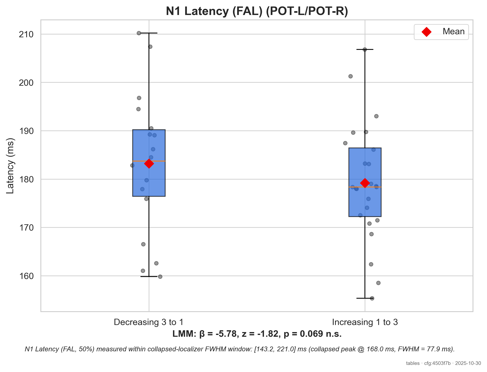

**Violin Plot:**

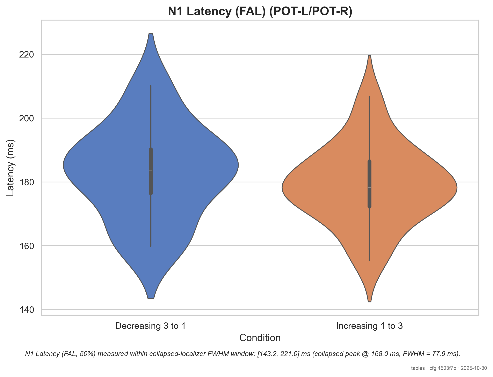

#### Amplitude

**Boxplot:**

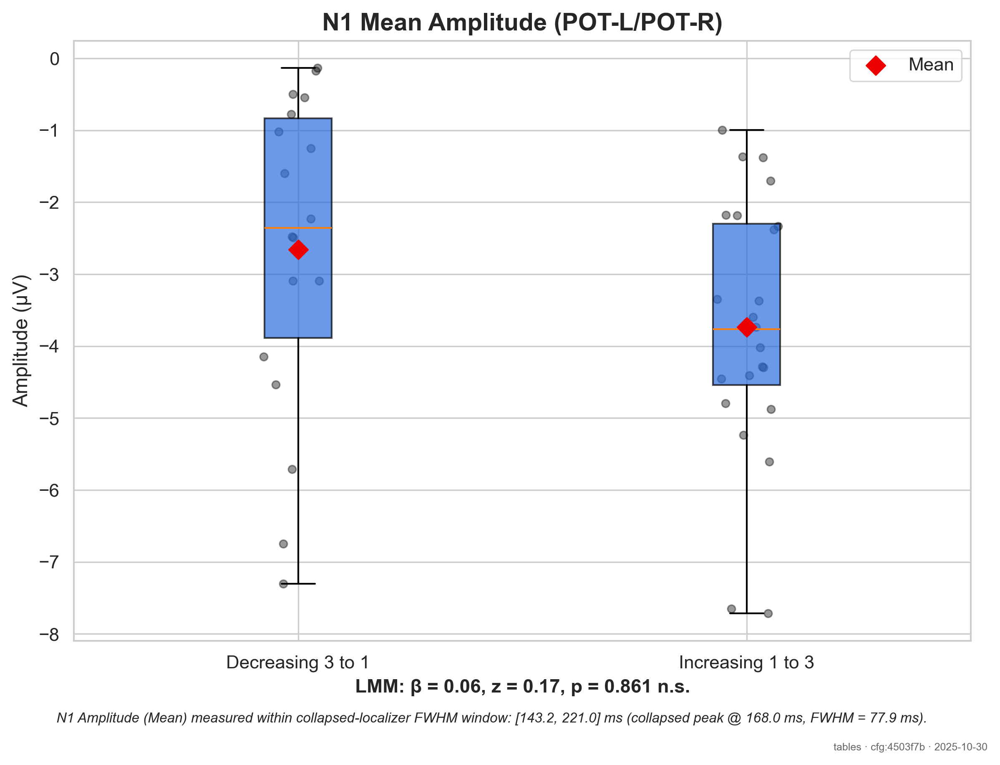

**Violin Plot:**

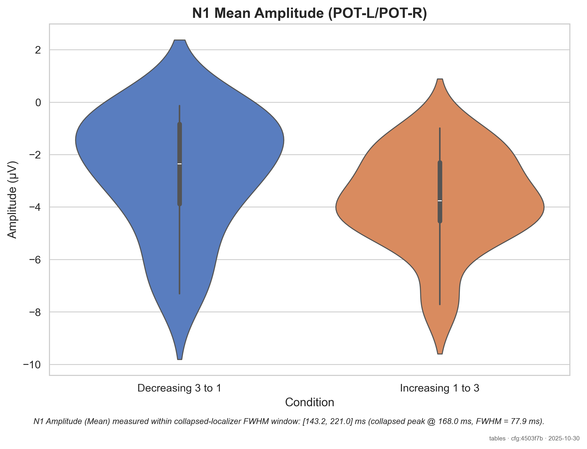

### 5.2 P1 Component

#### Latency

**Boxplot:**

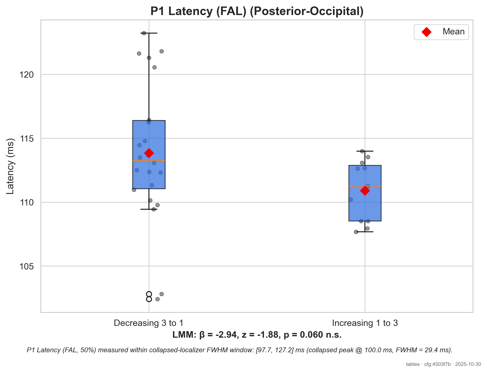

**Violin Plot:**

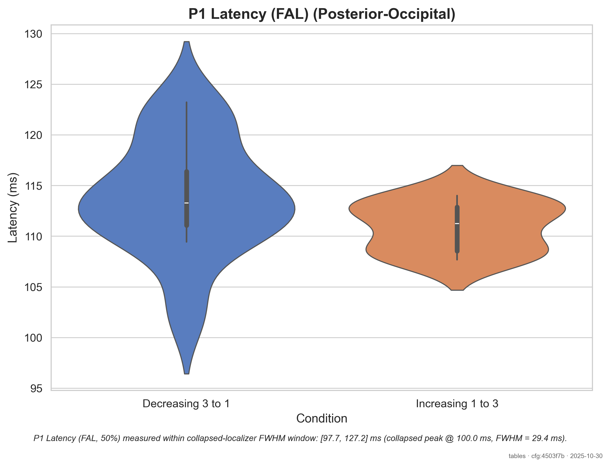

#### Amplitude

**Boxplot:**

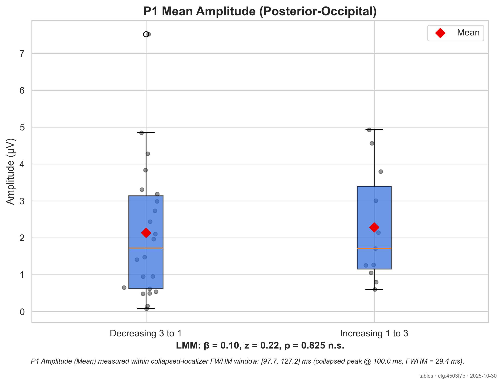

**Violin Plot:**

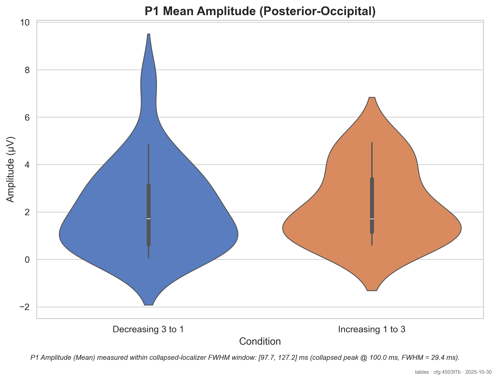

### 5.3 P3b Component

#### Latency

**Boxplot:**

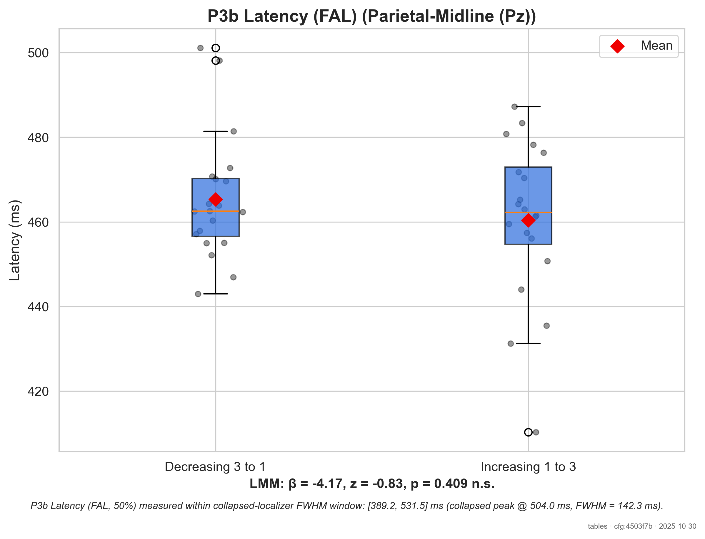

**Violin Plot:**

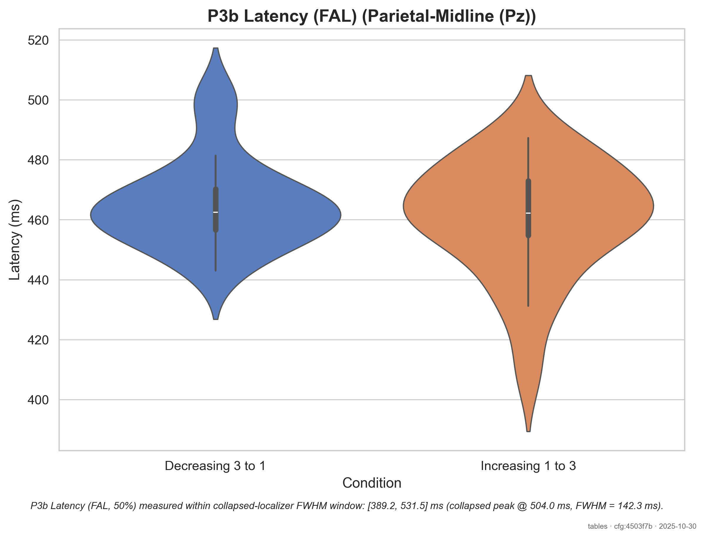

#### Amplitude

**Boxplot:**

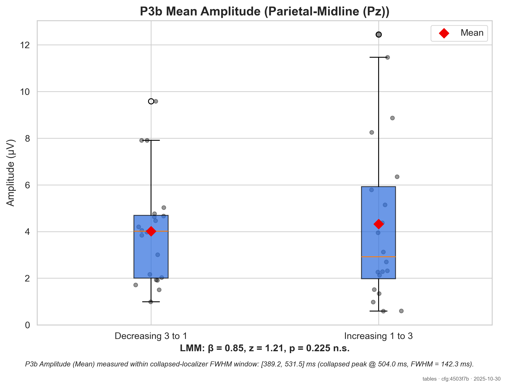

**Violin Plot:**

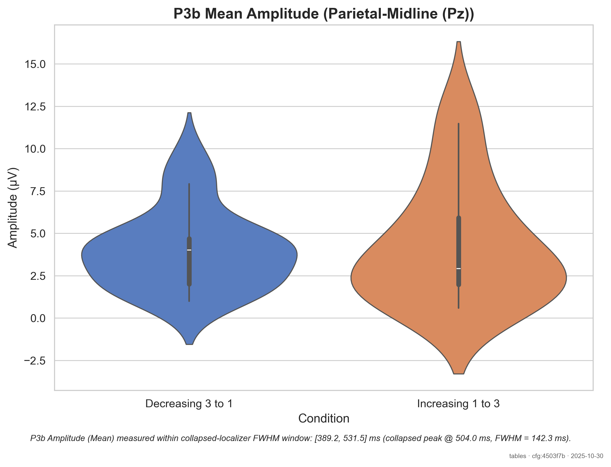

---

## 6. Methods Summary (for Publication)

### ERP Measurement

ERP components were measured using a collapsed localizer approach, where component peaks were identified from the grand average of all conditions combined to avoid circular analysis (Luck & Gaspelin, 2017). Measurement windows were defined as the full-width at half-maximum (FWHM) around each peak. Component latency was quantified using the 50% fractional area latency (FAL), which represents the time point at which the cumulative area under the curve reaches 50% of its total value within the measurement window. This metric provides a robust estimate of component timing with lower measurement error than peak latency (Kiesel et al., 2008). Mean amplitude was computed as the average voltage within the FWHM window across predefined regions of interest (ROI).

### Statistical Analysis

Within-subjects repeated-measures analyses were conducted using:
- Repeated-measures ANOVA with Greenhouse-Geisser correction for sphericity violations (ε < 0.75)
- Post-hoc pairwise t-tests with false discovery rate (FDR) correction for multiple comparisons
- Linear mixed-effects models (LMM) with random intercepts for subjects to handle missing data

Effect sizes are reported as Cohen's *d* for pairwise comparisons and generalized eta-squared (η²_G) for ANOVA.

### Software

- Python 3.12.11
- MNE-Python 1.10.1
- Statsmodels 0.14.5
- Pingouin 0.5.5

### References

- Kiesel, A., Miller, J., Jolicœur, P., & Brisson, B. (2008). Measurement of ERP latency differences: A comparison of single-participant and jackknife-based scoring methods. *Psychophysiology, 45*(2), 250-274.
- Luck, S. J., & Gaspelin, N. (2017). How to get statistically significant effects in any ERP experiment (and why you shouldn't). *Psychophysiology, 54*(1), 146-157.

---

---

*Report generated automatically by EEG Image Analysis Pipeline v2*
*For questions about this analysis, please refer to the YAML configuration and statistical output files.*
