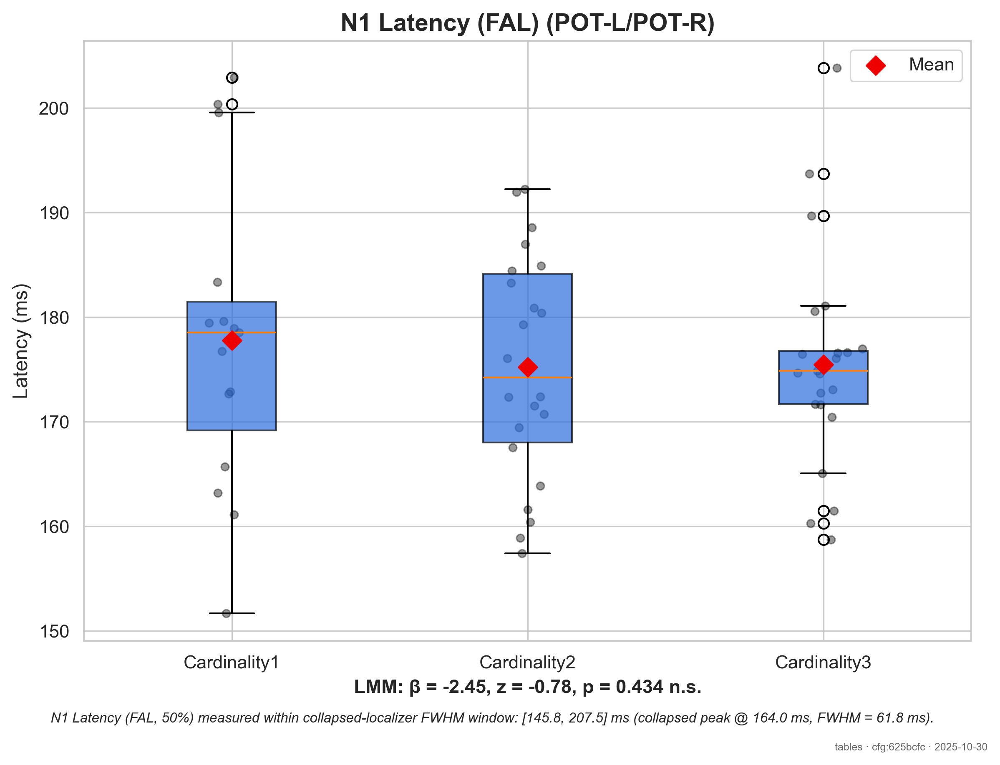
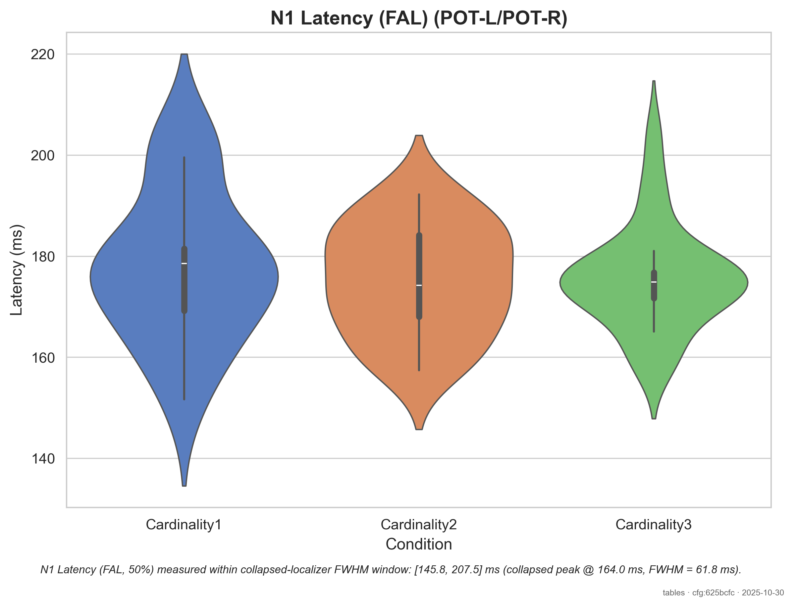
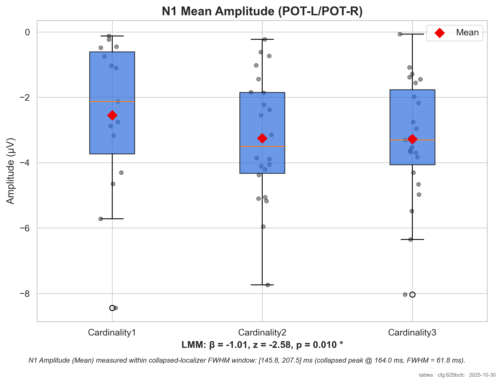
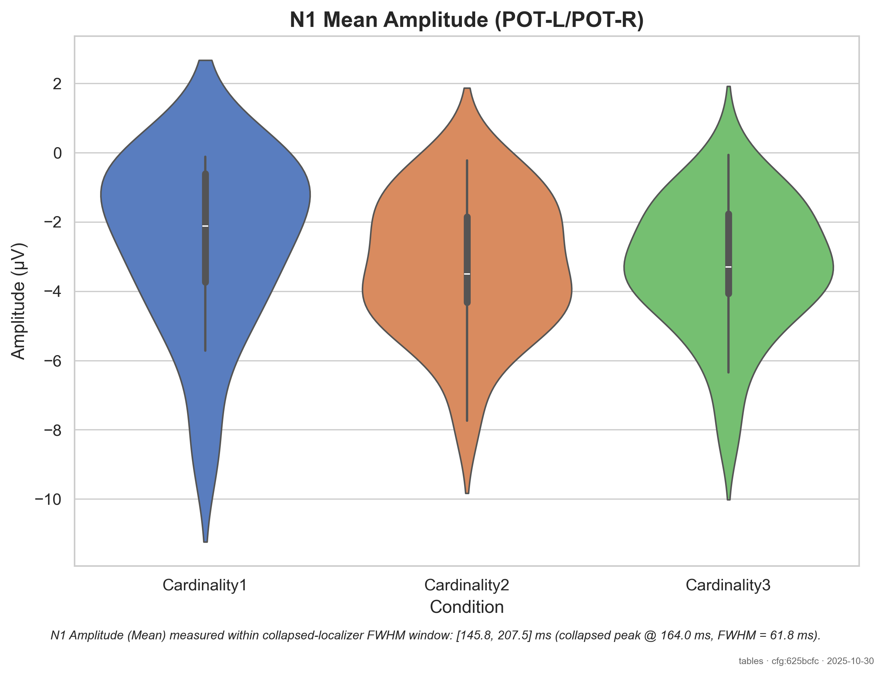
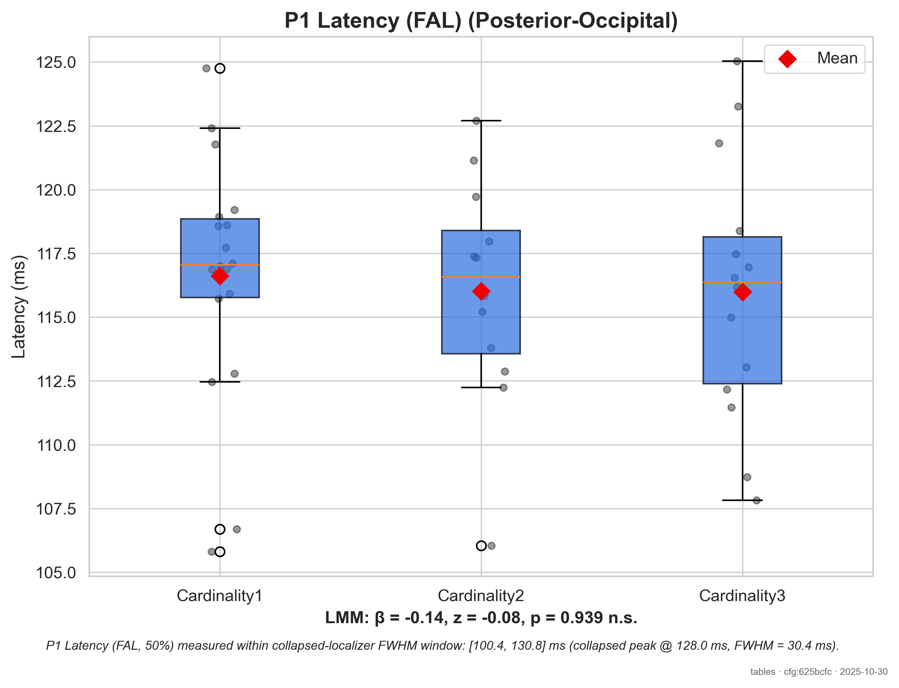
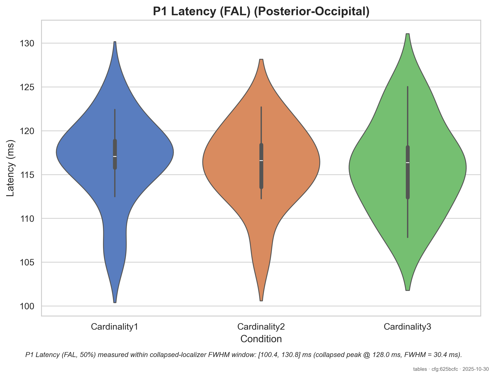
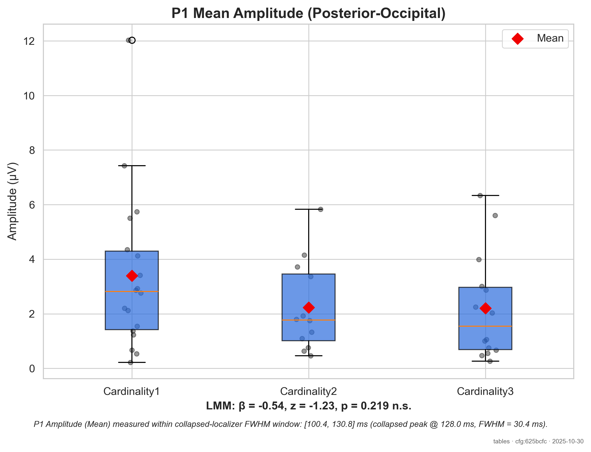
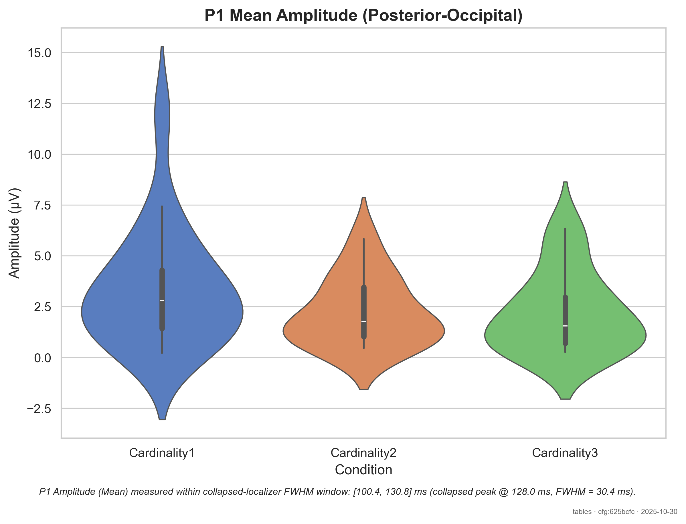

# Statistical Analysis Report: tables

**Generated:** 2025-10-13 19:59:32

---

## 1. Analysis Overview

**Total Measurements:** 24
**Number of Subjects:** 8
**Number of Conditions:** 3

**Components Analyzed:** N1, P1, P3b
**Dependent Variables:** Latency (50% Fractional Area), Mean Amplitude (ROI)

### 1.1 Measurement Methodology

- **Component Detection:** collapsed_localizer_fwhm
- **Latency Measure:** 50% Fractional Area Latency (temporal midpoint)
- **Baseline Period:** [-100, 0] ms

### 1.2 Quality Control Filters

- **Minimum SNR:** ≥ 2.0
- **Missing Data:** Excluded listwise for ANOVA/pairwise

### 1.3 Missing Data Policy

ANOVA and pairwise tests were run on complete cases after applying an SNR filter >= 2.0. Subject-condition combinations with missing latency values or below-threshold SNR were excluded listwise. Linear mixed-effects models retained all subjects with valid measurements to optimally handle missing data.

---

## 2. Descriptive Statistics

This section presents means, standard deviations, and sample sizes for each condition.

### 2.1 N1 Component

#### Latency (50% Fractional Area)

| Condition | N | Mean | SD | SEM | Range |
|-----------|---|------|----|----|-------|
| Cardinality1 | 1 | 163.84 ms | n/a | n/a | [163.84, 163.84] |
| Cardinality3 | 3 | 170.20 ms | 7.44 | 4.29 | [161.69, 175.47] |

#### Mean Amplitude (ROI)

| Condition | N | Mean | SD | SEM | Range |
|-----------|---|------|----|----|-------|
| Cardinality1 | 1 | -3.23 µV | n/a | n/a | [-3.23, -3.23] |
| Cardinality3 | 3 | -4.07 µV | 0.88 | 0.51 | [-5.07, -3.51] |

### 2.2 P1 Component

#### Latency (50% Fractional Area)

| Condition | N | Mean | SD | SEM | Range |
|-----------|---|------|----|----|-------|
| Cardinality1 | 1 | 115.60 ms | n/a | n/a | [115.60, 115.60] |

#### Mean Amplitude (ROI)

| Condition | N | Mean | SD | SEM | Range |
|-----------|---|------|----|----|-------|
| Cardinality1 | 1 | 3.58 µV | n/a | n/a | [3.58, 3.58] |

### 2.3 P3b Component

#### Latency (50% Fractional Area)

_No descriptive statistics available._

#### Mean Amplitude (ROI)

_No descriptive statistics available._

---

## 3. Inferential Statistics

This section presents the results of repeated-measures statistical tests.

### 3.1 N1 Component

#### Latency (50% Fractional Area)

_ANOVA results not available (may require pingouin library)._

_Pairwise test results not available._

**Linear Mixed-Effects Model:**

- Model converged successfully
- AIC = 12.23, BIC = 9.78
- Condition effect: *β* = -2.15, *SE* = 0.000, *z* = -10991.655, *p* < .001

#### Mean Amplitude (ROI)

_ANOVA results not available (may require pingouin library)._

_Pairwise test results not available._

**Linear Mixed-Effects Model:**

- Model converged successfully
- AIC = -4.89, BIC = -7.34
- Condition effect: *β* = -0.38, *SE* = 0.000, *z* = -16278.523, *p* < .001

### 3.2 P1 Component

#### Latency (50% Fractional Area)

_ANOVA results not available (may require pingouin library)._

_Pairwise test results not available._

**Linear Mixed-Effects Model:**

_LMM did not converge or had numerical issues._

#### Mean Amplitude (ROI)

_ANOVA results not available (may require pingouin library)._

_Pairwise test results not available._

**Linear Mixed-Effects Model:**

_LMM did not converge or had numerical issues._

### 3.3 P3b Component

#### Latency (50% Fractional Area)

_ANOVA results not available (may require pingouin library)._

_Pairwise test results not available._

_LMM results not available._

#### Mean Amplitude (ROI)

_ANOVA results not available (may require pingouin library)._

_Pairwise test results not available._

_LMM results not available._

---

## 4. Overall Interpretation

### Key Findings

No significant main effects or interactions were detected at the α = .05 level.

### Research Implications

_[Researchers should interpret these findings in the context of their theoretical framework and study design.]_

---

## 5. Visualizations

The following plots are available in the `plots/` subdirectory:

### 5.1 N1 Component

#### Latency

**Boxplot:**

**Violin Plot:**

#### Amplitude

**Boxplot:**

**Violin Plot:**

### 5.2 P1 Component

#### Latency

**Boxplot:**

**Violin Plot:**

#### Amplitude

**Boxplot:**

**Violin Plot:**

### 5.3 P3b Component

#### Latency

#### Amplitude

---

## 6. Methods Summary (for Publication)

### ERP Measurement

ERP components were measured using a collapsed localizer approach, where component peaks were identified from the grand average of all conditions combined to avoid circular analysis (Luck & Gaspelin, 2017). Measurement windows were defined as the full-width at half-maximum (FWHM) around each peak. Component latency was quantified using the 50% fractional area latency (FAL), which represents the time point at which the cumulative area under the curve reaches 50% of its total value within the measurement window. This metric provides a robust estimate of component timing with lower measurement error than peak latency (Kiesel et al., 2008). Mean amplitude was computed as the average voltage within the FWHM window across predefined regions of interest (ROI).

Quality control filtering excluded subject-component measurements with signal-to-noise ratio (SNR) below 2.0.

### Statistical Analysis

Within-subjects repeated-measures analyses were conducted using:
- Repeated-measures ANOVA with Greenhouse-Geisser correction for sphericity violations (ε < 0.75)
- Post-hoc pairwise t-tests with false discovery rate (FDR) correction for multiple comparisons
- Linear mixed-effects models (LMM) with random intercepts for subjects to handle missing data

Effect sizes are reported as Cohen's *d* for pairwise comparisons and generalized eta-squared (η²_G) for ANOVA.

### Software

- Python 3.12.11
- MNE-Python 1.10.1
- Statsmodels 0.14.5

### References

- Kiesel, A., Miller, J., Jolicœur, P., & Brisson, B. (2008). Measurement of ERP latency differences: A comparison of single-participant and jackknife-based scoring methods. *Psychophysiology, 45*(2), 250-274.
- Luck, S. J., & Gaspelin, N. (2017). How to get statistically significant effects in any ERP experiment (and why you shouldn't). *Psychophysiology, 54*(1), 146-157.

---

---

*Report generated automatically by EEG Image Analysis Pipeline v2*
*For questions about this analysis, please refer to the YAML configuration and statistical output files.*
