# Statistical Analysis Report: tables

**Generated:** 2026-02-23 19:20:58

---

## 1. Analysis Overview

**Total Measurements:** 480
**Number of Subjects:** 24
**Number of Conditions:** 5

**Components Analyzed:** Fz, N1, P1, P3b
**Dependent Variables:** Latency (Peak), Amplitude (Peak)

### 1.1 Measurement Methodology

- **Component Detection:** collapsed_localizer_fwhm
- **Latency Measure:** Peak latency within FWHM window
- **Amplitude Measure:** Peak amplitude within FWHM window
- **Baseline Period:** [-100, 0] ms

### 1.2 Quality Control Filters

- **Minimum SNR:** ≥ None
- **Missing Data:** Excluded listwise for ANOVA/pairwise

### 1.3 Missing Data Policy

ANOVA and pairwise tests were run on complete cases. Subject-condition combinations with missing latency values or below-threshold SNR were excluded listwise. Linear mixed-effects models retained all subjects with valid measurements to optimally handle missing data.

---

## 2. Descriptive Statistics

This section presents means, standard deviations, and sample sizes for each condition.

### 2.1 Fz Component

#### Latency (Peak)

| Condition | N | Mean | SD | SEM | Range |
|-----------|---|------|----|----|-------|
| 4 to 1 | 24 | 104.17 ms | 10.58 | 2.16 | [92.00, 116.00] |
| 4 to 2 | 24 | 106.33 ms | 9.28 | 1.89 | [92.00, 116.00] |
| 4 to 3 | 24 | 104.33 ms | 8.74 | 1.78 | [92.00, 116.00] |
| 4 to 5 | 24 | 99.83 ms | 8.38 | 1.71 | [92.00, 116.00] |
| 4 to 6 | 24 | 102.00 ms | 8.83 | 1.80 | [92.00, 116.00] |

#### Amplitude (Peak)

| Condition | N | Mean | SD | SEM | Range |
|-----------|---|------|----|----|-------|
| 4 to 1 | 24 | -2.52 µV | 2.65 | 0.54 | [-8.54, 2.69] |
| 4 to 2 | 24 | -0.73 µV | 2.42 | 0.49 | [-4.94, 4.46] |
| 4 to 3 | 24 | -0.82 µV | 2.13 | 0.44 | [-6.08, 3.45] |
| 4 to 5 | 24 | -1.78 µV | 3.32 | 0.68 | [-10.33, 4.96] |
| 4 to 6 | 24 | -1.12 µV | 2.17 | 0.44 | [-4.45, 2.92] |

### 2.2 N1 Component

#### Latency (Peak)

| Condition | N | Mean | SD | SEM | Range |
|-----------|---|------|----|----|-------|
| 4 to 1 | 24 | 183.17 ms | 14.15 | 2.89 | [144.00, 208.00] |
| 4 to 2 | 24 | 174.67 ms | 14.81 | 3.02 | [148.00, 208.00] |
| 4 to 3 | 24 | 176.17 ms | 17.91 | 3.66 | [148.00, 208.00] |
| 4 to 5 | 24 | 169.83 ms | 21.00 | 4.29 | [144.00, 208.00] |
| 4 to 6 | 24 | 171.83 ms | 21.05 | 4.30 | [144.00, 204.00] |

#### Amplitude (Peak)

| Condition | N | Mean | SD | SEM | Range |
|-----------|---|------|----|----|-------|
| 4 to 1 | 24 | -3.52 µV | 2.02 | 0.41 | [-8.09, 0.13] |
| 4 to 2 | 24 | -6.13 µV | 3.05 | 0.62 | [-11.92, -1.89] |
| 4 to 3 | 24 | -6.07 µV | 2.68 | 0.55 | [-11.27, 1.75] |
| 4 to 5 | 24 | -5.55 µV | 2.87 | 0.59 | [-11.05, -0.28] |
| 4 to 6 | 24 | -5.87 µV | 3.18 | 0.65 | [-13.20, 0.34] |

### 2.3 P1 Component

#### Latency (Peak)

| Condition | N | Mean | SD | SEM | Range |
|-----------|---|------|----|----|-------|
| 4 to 1 | 24 | 110.17 ms | 8.00 | 1.63 | [96.00, 116.00] |
| 4 to 2 | 24 | 109.67 ms | 7.73 | 1.58 | [96.00, 116.00] |
| 4 to 3 | 24 | 105.50 ms | 8.24 | 1.68 | [96.00, 116.00] |
| 4 to 5 | 24 | 104.17 ms | 8.71 | 1.78 | [96.00, 116.00] |
| 4 to 6 | 24 | 104.00 ms | 7.64 | 1.56 | [96.00, 116.00] |

#### Amplitude (Peak)

| Condition | N | Mean | SD | SEM | Range |
|-----------|---|------|----|----|-------|
| 4 to 1 | 24 | 3.14 µV | 3.57 | 0.73 | [-2.67, 13.38] |
| 4 to 2 | 24 | 0.72 µV | 2.48 | 0.51 | [-5.66, 4.31] |
| 4 to 3 | 24 | 0.71 µV | 2.18 | 0.45 | [-2.73, 5.30] |
| 4 to 5 | 24 | 1.68 µV | 3.56 | 0.73 | [-3.18, 13.41] |
| 4 to 6 | 24 | 1.20 µV | 2.31 | 0.47 | [-2.15, 5.39] |

### 2.4 P3b Component

#### Latency (Peak)

| Condition | N | Mean | SD | SEM | Range |
|-----------|---|------|----|----|-------|
| 4 to 1 | 24 | 486.00 ms | 35.52 | 7.25 | [428.00, 540.00] |
| 4 to 2 | 24 | 478.00 ms | 38.29 | 7.82 | [428.00, 540.00] |
| 4 to 3 | 24 | 474.50 ms | 34.08 | 6.96 | [428.00, 536.00] |
| 4 to 5 | 24 | 483.17 ms | 38.53 | 7.86 | [428.00, 540.00] |
| 4 to 6 | 24 | 492.33 ms | 35.72 | 7.29 | [436.00, 540.00] |

#### Amplitude (Peak)

| Condition | N | Mean | SD | SEM | Range |
|-----------|---|------|----|----|-------|
| 4 to 1 | 24 | 5.23 µV | 3.58 | 0.73 | [-2.02, 12.03] |
| 4 to 2 | 24 | 4.21 µV | 3.81 | 0.78 | [-3.50, 11.62] |
| 4 to 3 | 24 | 4.69 µV | 3.50 | 0.72 | [-1.86, 11.65] |
| 4 to 5 | 24 | 3.99 µV | 4.44 | 0.91 | [-3.22, 16.10] |
| 4 to 6 | 24 | 4.52 µV | 3.47 | 0.71 | [-1.42, 9.75] |

---

## 3. Inferential Statistics

This section presents the results of repeated-measures statistical tests.

### 3.1 Fz Component

#### Latency (Peak)

**Linear Mixed-Effects Model (Primary Analysis):**

- Model converged successfully
- AIC = 880.04, BIC = 902.34
- **4 to 2 vs 4 to 1**: *β* = 2.50, *SE* = 2.562, *z* = 0.975, *p* = 0.329
- **4 to 3 vs 4 to 1**: *β* = 0.54, *SE* = 2.564, *z* = 0.212, *p* = 0.832
- **4 to 5 vs 4 to 1**: *β* = -4.90, *SE* = 2.573, *z* = -1.903, *p* = 0.057
- **4 to 6 vs 4 to 1**: *β* = -2.26, *SE* = 2.557, *z* = -0.885, *p* = 0.376
- **SNR**: *β* = 0.87, *SE* = 0.443, *z* = 1.964, *p* = 0.050

_Reference condition: **4 to 1** (all condition effects are contrasts vs. this baseline)._
_For complete inference across all condition pairs, see the LMM Pairwise Comparisons below._

_Note: LMM uses all available subject data via maximum likelihood estimation._

**LMM Pairwise Comparisons:**

All pairwise comparisons between conditions (Holm-Sidak correction):

| Comparison | β | SE | z | p (unadj) | p (adj) | Sig |
|------------|---|----|----|-----------|---------|-----|
| 4 to 1 - 4 to 2 | -2.50 | 2.56 | -0.98 | 0.329 | 0.854 | n.s. |
| 4 to 1 - 4 to 3 | -0.54 | 2.56 | -0.21 | 0.832 | 0.854 | n.s. |
| 4 to 1 - 4 to 5 | 4.90 | 2.57 | 1.90 | 0.057 | 0.375 | n.s. |
| 4 to 1 - 4 to 6 | 2.26 | 2.56 | 0.88 | 0.376 | 0.854 | n.s. |
| 4 to 2 - 4 to 3 | 1.95 | 2.56 | 0.76 | 0.445 | 0.854 | n.s. |
| 4 to 2 - 4 to 5 | 7.40 | 2.60 | 2.85 | 0.004 | 0.043 | * |
| 4 to 2 - 4 to 6 | 4.76 | 2.57 | 1.86 | 0.063 | 0.375 | n.s. |
| 4 to 3 - 4 to 5 | 5.44 | 2.60 | 2.09 | 0.036 | 0.284 | n.s. |
| 4 to 3 - 4 to 6 | 2.81 | 2.57 | 1.09 | 0.274 | 0.854 | n.s. |
| 4 to 5 - 4 to 6 | -2.63 | 2.57 | -1.03 | 0.305 | 0.854 | n.s. |

_Note: p-values adjusted using Holm-Sidak method for 10 comparisons._
_Tests use Wald z-statistics on fixed-effect contrasts (MixedLM)._

**Repeated-Measures ANOVA (Supplementary Analysis):**

- *F* = 1.68, *p* = 0.160, η²_G = 0.058
- Greenhouse-Geisser corrected: *p* = 0.183 (ε = 0.695)
- **Interpretation:** The main effect of condition was **not significant**.

**Pairwise Comparisons (Supplementary Analysis):**

_Post-hoc paired t-tests on complete cases with FDR correction:_

| Comparison | *t* | *df* | *p* (corrected) | Cohen's *d* | Effect Size | Sig. |
|------------|-----|------|----------------|-------------|-------------|------|
| 4 to 1 vs 4 to 2 | -0.87 | 23 | = 0.530 | -0.22 [-0.60, 0.25] | small | n.s. |
| 4 to 1 vs 4 to 3 | -0.05 | 23 | = 0.964 | -0.02 [-0.43, 0.41] | negligible | n.s. |
| 4 to 1 vs 4 to 5 | 1.40 | 23 | = 0.436 | 0.45 [-0.14, 0.72] | small | n.s. |
| 4 to 1 vs 4 to 6 | 0.74 | 23 | = 0.530 | 0.22 [-0.27, 0.58] | small | n.s. |
| 4 to 2 vs 4 to 3 | 0.72 | 23 | = 0.530 | 0.22 [-0.28, 0.57] | small | n.s. |
| 4 to 2 vs 4 to 5 | 2.39 | 23 | = 0.173 | 0.74 [0.04, 0.93] | medium | n.s. |
| 4 to 2 vs 4 to 6 | 1.63 | 23 | = 0.389 | 0.48 [-0.10, 0.77] | small | n.s. |
| 4 to 3 vs 4 to 5 | 2.24 | 23 | = 0.173 | 0.53 [0.01, 0.90] | medium | n.s. |
| 4 to 3 vs 4 to 6 | 1.06 | 23 | = 0.530 | 0.27 [-0.21, 0.64] | small | n.s. |
| 4 to 5 vs 4 to 6 | -0.97 | 23 | = 0.530 | -0.25 [-0.62, 0.23] | small | n.s. |

_Note: These are paired t-tests restricted to subjects with all conditions (listwise deletion). LMM pairwise (if present above) uses all available data via mixed models._
_Legend: * p < .05, ** p < .01, *** p < .001; n.s. = not significant_

#### Amplitude (Peak)

**Linear Mixed-Effects Model (Primary Analysis):**

- Model converged successfully
- AIC = 558.42, BIC = 580.72
- **4 to 2 vs 4 to 1**: *β* = 1.71, *SE* = 0.596, *z* = 2.860, *p* = 0.004
- **4 to 3 vs 4 to 1**: *β* = 1.60, *SE* = 0.596, *z* = 2.691, *p* = 0.007
- **4 to 5 vs 4 to 1**: *β* = 0.89, *SE* = 0.599, *z* = 1.480, *p* = 0.139
- **4 to 6 vs 4 to 1**: *β* = 1.42, *SE* = 0.595, *z* = 2.392, *p* = 0.017
- **SNR**: *β* = -0.22, *SE* = 0.110, *z* = -2.007, *p* = 0.045

_Reference condition: **4 to 1** (all condition effects are contrasts vs. this baseline)._
_For complete inference across all condition pairs, see the LMM Pairwise Comparisons below._

_Note: LMM uses all available subject data via maximum likelihood estimation._

**LMM Pairwise Comparisons:**

All pairwise comparisons between conditions (Holm-Sidak correction):

| Comparison | β | SE | z | p (unadj) | p (adj) | Sig |
|------------|---|----|----|-----------|---------|-----|
| 4 to 1 - 4 to 2 | -1.70 | 0.60 | -2.86 | 0.004 | 0.042 | * |
| 4 to 1 - 4 to 3 | -1.61 | 0.60 | -2.69 | 0.007 | 0.062 | n.s. |
| 4 to 1 - 4 to 5 | -0.89 | 0.60 | -1.48 | 0.139 | 0.649 | n.s. |
| 4 to 1 - 4 to 6 | -1.42 | 0.59 | -2.39 | 0.017 | 0.127 | n.s. |
| 4 to 2 - 4 to 3 | 0.10 | 0.59 | 0.17 | 0.867 | 0.952 | n.s. |
| 4 to 2 - 4 to 5 | 0.82 | 0.61 | 1.35 | 0.176 | 0.688 | n.s. |
| 4 to 2 - 4 to 6 | 0.28 | 0.60 | 0.47 | 0.636 | 0.952 | n.s. |
| 4 to 3 - 4 to 5 | 0.72 | 0.61 | 1.19 | 0.236 | 0.739 | n.s. |
| 4 to 3 - 4 to 6 | 0.18 | 0.60 | 0.31 | 0.759 | 0.952 | n.s. |
| 4 to 5 - 4 to 6 | -0.54 | 0.60 | -0.90 | 0.370 | 0.842 | n.s. |

_Note: p-values adjusted using Holm-Sidak method for 10 comparisons._
_Tests use Wald z-statistics on fixed-effect contrasts (MixedLM)._

**Repeated-Measures ANOVA (Supplementary Analysis):**

- *F* = 2.96, *p* = 0.024, η²_G = 0.066
- **Interpretation:** The main effect of condition was **significant**.

**Pairwise Comparisons (Supplementary Analysis):**

_Post-hoc paired t-tests on complete cases with FDR correction:_

| Comparison | *t* | *df* | *p* (corrected) | Cohen's *d* | Effect Size | Sig. |
|------------|-----|------|----------------|-------------|-------------|------|
| 4 to 1 vs 4 to 2 | -2.99 | 23 | = 0.033 | -0.71 [-1.07, -0.15] | medium | * |
| 4 to 1 vs 4 to 3 | -3.64 | 23 | = 0.014 | -0.71 [-1.22, -0.27] | medium | * |
| 4 to 1 vs 4 to 5 | -1.17 | 23 | = 0.424 | -0.25 [-0.67, 0.19] | small | n.s. |
| 4 to 1 vs 4 to 6 | -1.86 | 23 | = 0.204 | -0.58 [-0.82, 0.06] | medium | n.s. |
| 4 to 2 vs 4 to 3 | 0.16 | 23 | = 0.874 | 0.04 [-0.39, 0.46] | negligible | n.s. |
| 4 to 2 vs 4 to 5 | 1.65 | 23 | = 0.223 | 0.36 [-0.10, 0.77] | small | n.s. |
| 4 to 2 vs 4 to 6 | 0.56 | 23 | = 0.645 | 0.17 [-0.31, 0.54] | negligible | n.s. |
| 4 to 3 vs 4 to 5 | 1.82 | 23 | = 0.204 | 0.34 [-0.06, 0.81] | small | n.s. |
| 4 to 3 vs 4 to 6 | 0.56 | 23 | = 0.645 | 0.14 [-0.31, 0.54] | negligible | n.s. |
| 4 to 5 vs 4 to 6 | -0.91 | 23 | = 0.531 | -0.23 [-0.61, 0.24] | small | n.s. |

_Note: These are paired t-tests restricted to subjects with all conditions (listwise deletion). LMM pairwise (if present above) uses all available data via mixed models._
_Legend: * p < .05, ** p < .01, *** p < .001; n.s. = not significant_

### 3.2 N1 Component

#### Latency (Peak)

**Linear Mixed-Effects Model (Primary Analysis):**

- Model converged successfully
- AIC = 1018.09, BIC = 1040.39
- **4 to 2 vs 4 to 1**: *β* = -9.13, *SE* = 3.975, *z* = -2.297, *p* = 0.022
- **4 to 3 vs 4 to 1**: *β* = -8.09, *SE* = 4.114, *z* = -1.966, *p* = 0.049
- **4 to 5 vs 4 to 1**: *β* = -14.09, *SE* = 4.005, *z* = -3.517, *p* < .001
- **4 to 6 vs 4 to 1**: *β* = -12.30, *SE* = 4.069, *z* = -3.022, *p* = 0.003
- **SNR**: *β* = 0.46, *SE* = 0.546, *z* = 0.837, *p* = 0.402

_Reference condition: **4 to 1** (all condition effects are contrasts vs. this baseline)._
_For complete inference across all condition pairs, see the LMM Pairwise Comparisons below._

_Note: LMM uses all available subject data via maximum likelihood estimation._

**LMM Pairwise Comparisons:**

All pairwise comparisons between conditions (Holm-Sidak correction):

| Comparison | β | SE | z | p (unadj) | p (adj) | Sig |
|------------|---|----|----|-----------|---------|-----|
| 4 to 1 - 4 to 2 | 9.13 | 3.98 | 2.30 | 0.022 | 0.160 | n.s. |
| 4 to 1 - 4 to 3 | 8.09 | 4.11 | 1.97 | 0.049 | 0.298 | n.s. |
| 4 to 1 - 4 to 5 | 14.09 | 4.01 | 3.52 | < .001 | 0.004 | ** |
| 4 to 1 - 4 to 6 | 12.30 | 4.07 | 3.02 | 0.003 | 0.022 | * |
| 4 to 2 - 4 to 3 | -1.04 | 3.94 | -0.26 | 0.791 | 0.875 | n.s. |
| 4 to 2 - 4 to 5 | 4.95 | 3.91 | 1.27 | 0.205 | 0.682 | n.s. |
| 4 to 2 - 4 to 6 | 3.16 | 3.92 | 0.81 | 0.420 | 0.805 | n.s. |
| 4 to 3 - 4 to 5 | 6.00 | 3.92 | 1.53 | 0.126 | 0.556 | n.s. |
| 4 to 3 - 4 to 6 | 4.21 | 3.91 | 1.08 | 0.282 | 0.734 | n.s. |
| 4 to 5 - 4 to 6 | -1.79 | 3.91 | -0.46 | 0.647 | 0.875 | n.s. |

_Note: p-values adjusted using Holm-Sidak method for 10 comparisons._
_Tests use Wald z-statistics on fixed-effect contrasts (MixedLM)._

**Repeated-Measures ANOVA (Supplementary Analysis):**

- *F* = 3.25, *p* = 0.015, η²_G = 0.063
- **Interpretation:** The main effect of condition was **significant**.

**Pairwise Comparisons (Supplementary Analysis):**

_Post-hoc paired t-tests on complete cases with FDR correction:_

| Comparison | *t* | *df* | *p* (corrected) | Cohen's *d* | Effect Size | Sig. |
|------------|-----|------|----------------|-------------|-------------|------|
| 4 to 1 vs 4 to 2 | 2.41 | 23 | = 0.081 | 0.59 [0.05, 0.94] | medium | n.s. |
| 4 to 1 vs 4 to 3 | 1.98 | 23 | = 0.150 | 0.43 [-0.04, 0.84] | small | n.s. |
| 4 to 1 vs 4 to 5 | 3.05 | 23 | = 0.041 | 0.74 [0.16, 1.08] | medium | * |
| 4 to 1 vs 4 to 6 | 2.89 | 23 | = 0.041 | 0.63 [0.13, 1.05] | medium | * |
| 4 to 2 vs 4 to 3 | -0.41 | 23 | = 0.686 | -0.09 [-0.51, 0.34] | negligible | n.s. |
| 4 to 2 vs 4 to 5 | 1.49 | 23 | = 0.298 | 0.27 [-0.13, 0.74] | small | n.s. |
| 4 to 2 vs 4 to 6 | 0.69 | 23 | = 0.625 | 0.16 [-0.28, 0.56] | negligible | n.s. |
| 4 to 3 vs 4 to 5 | 1.31 | 23 | = 0.336 | 0.32 [-0.16, 0.70] | small | n.s. |
| 4 to 3 vs 4 to 6 | 1.03 | 23 | = 0.448 | 0.22 [-0.22, 0.64] | small | n.s. |
| 4 to 5 vs 4 to 6 | -0.45 | 23 | = 0.686 | -0.10 [-0.51, 0.33] | negligible | n.s. |

_Note: These are paired t-tests restricted to subjects with all conditions (listwise deletion). LMM pairwise (if present above) uses all available data via mixed models._
_Legend: * p < .05, ** p < .01, *** p < .001; n.s. = not significant_

#### Amplitude (Peak)

**Linear Mixed-Effects Model (Primary Analysis):**

- Model converged successfully
- AIC = 529.67, BIC = 551.97
- **4 to 2 vs 4 to 1**: *β* = -1.99, *SE* = 0.518, *z* = -3.830, *p* < .001
- **4 to 3 vs 4 to 1**: *β* = -1.47, *SE* = 0.536, *z* = -2.734, *p* = 0.006
- **4 to 5 vs 4 to 1**: *β* = -1.28, *SE* = 0.522, *z* = -2.453, *p* = 0.014
- **4 to 6 vs 4 to 1**: *β* = -1.40, *SE* = 0.530, *z* = -2.633, *p* = 0.008
- **SNR**: *β* = -0.45, *SE* = 0.071, *z* = -6.362, *p* < .001

_Reference condition: **4 to 1** (all condition effects are contrasts vs. this baseline)._
_For complete inference across all condition pairs, see the LMM Pairwise Comparisons below._

_Note: LMM uses all available subject data via maximum likelihood estimation._

**LMM Pairwise Comparisons:**

All pairwise comparisons between conditions (Holm-Sidak correction):

| Comparison | β | SE | z | p (unadj) | p (adj) | Sig |
|------------|---|----|----|-----------|---------|-----|
| 4 to 1 - 4 to 2 | 1.98 | 0.52 | 3.83 | < .001 | 0.001 | ** |
| 4 to 1 - 4 to 3 | 1.47 | 0.54 | 2.73 | 0.006 | 0.055 | n.s. |
| 4 to 1 - 4 to 5 | 1.28 | 0.52 | 2.45 | 0.014 | 0.095 | n.s. |
| 4 to 1 - 4 to 6 | 1.40 | 0.53 | 2.63 | 0.008 | 0.066 | n.s. |
| 4 to 2 - 4 to 3 | -0.52 | 0.51 | -1.01 | 0.313 | 0.777 | n.s. |
| 4 to 2 - 4 to 5 | -0.70 | 0.51 | -1.38 | 0.167 | 0.665 | n.s. |
| 4 to 2 - 4 to 6 | -0.59 | 0.51 | -1.15 | 0.250 | 0.763 | n.s. |
| 4 to 3 - 4 to 5 | -0.19 | 0.51 | -0.36 | 0.717 | 0.977 | n.s. |
| 4 to 3 - 4 to 6 | -0.07 | 0.51 | -0.14 | 0.891 | 0.977 | n.s. |
| 4 to 5 - 4 to 6 | 0.12 | 0.51 | 0.23 | 0.821 | 0.977 | n.s. |

_Note: p-values adjusted using Holm-Sidak method for 10 comparisons._
_Tests use Wald z-statistics on fixed-effect contrasts (MixedLM)._

**Repeated-Measures ANOVA (Supplementary Analysis):**

- *F* = 6.66, *p* < .001, η²_G = 0.113
- **Interpretation:** The main effect of condition was **highly significant**.

**Pairwise Comparisons (Supplementary Analysis):**

_Post-hoc paired t-tests on complete cases with FDR correction:_

| Comparison | *t* | *df* | *p* (corrected) | Cohen's *d* | Effect Size | Sig. |
|------------|-----|------|----------------|-------------|-------------|------|
| 4 to 1 vs 4 to 2 | 4.07 | 23 | = 0.002 | 1.01 [0.34, 1.32] | large | ** |
| 4 to 1 vs 4 to 3 | 4.32 | 23 | = 0.002 | 1.07 [0.38, 1.38] | large | ** |
| 4 to 1 vs 4 to 5 | 3.39 | 23 | = 0.007 | 0.82 [0.22, 1.16] | large | ** |
| 4 to 1 vs 4 to 6 | 3.33 | 23 | = 0.007 | 0.88 [0.21, 1.15] | large | ** |
| 4 to 2 vs 4 to 3 | -0.11 | 23 | = 0.915 | -0.02 [-0.44, 0.40] | negligible | n.s. |
| 4 to 2 vs 4 to 5 | -0.98 | 23 | = 0.561 | -0.20 [-0.63, 0.23] | negligible | n.s. |
| 4 to 2 vs 4 to 6 | -0.50 | 23 | = 0.775 | -0.08 [-0.53, 0.32] | negligible | n.s. |
| 4 to 3 vs 4 to 5 | -1.01 | 23 | = 0.561 | -0.19 [-0.63, 0.22] | negligible | n.s. |
| 4 to 3 vs 4 to 6 | -0.33 | 23 | = 0.829 | -0.07 [-0.49, 0.36] | negligible | n.s. |
| 4 to 5 vs 4 to 6 | 0.54 | 23 | = 0.775 | 0.11 [-0.31, 0.53] | negligible | n.s. |

_Note: These are paired t-tests restricted to subjects with all conditions (listwise deletion). LMM pairwise (if present above) uses all available data via mixed models._
_Legend: * p < .05, ** p < .01, *** p < .001; n.s. = not significant_

### 3.3 P1 Component

#### Latency (Peak)

**Linear Mixed-Effects Model (Primary Analysis):**

- Model converged successfully
- AIC = 845.07, BIC = 867.37
- **4 to 2 vs 4 to 1**: *β* = 0.08, *SE* = 2.115, *z* = 0.039, *p* = 0.969
- **4 to 3 vs 4 to 1**: *β* = -4.33, *SE* = 2.066, *z* = -2.098, *p* = 0.036
- **4 to 5 vs 4 to 1**: *β* = -5.76, *SE* = 2.054, *z* = -2.805, *p* = 0.005
- **4 to 6 vs 4 to 1**: *β* = -5.78, *SE* = 2.074, *z* = -2.789, *p* = 0.005
- **SNR**: *β* = 0.44, *SE* = 0.417, *z* = 1.052, *p* = 0.293

_Reference condition: **4 to 1** (all condition effects are contrasts vs. this baseline)._
_For complete inference across all condition pairs, see the LMM Pairwise Comparisons below._

_Note: LMM uses all available subject data via maximum likelihood estimation._

**LMM Pairwise Comparisons:**

All pairwise comparisons between conditions (Holm-Sidak correction):

| Comparison | β | SE | z | p (unadj) | p (adj) | Sig |
|------------|---|----|----|-----------|---------|-----|
| 4 to 1 - 4 to 2 | -0.08 | 2.11 | -0.04 | 0.969 | 0.999 | n.s. |
| 4 to 1 - 4 to 3 | 4.33 | 2.07 | 2.10 | 0.036 | 0.176 | n.s. |
| 4 to 1 - 4 to 5 | 5.76 | 2.05 | 2.81 | 0.005 | 0.042 | * |
| 4 to 1 - 4 to 6 | 5.78 | 2.07 | 2.79 | 0.005 | 0.042 | * |
| 4 to 2 - 4 to 3 | 4.42 | 2.05 | 2.15 | 0.032 | 0.176 | n.s. |
| 4 to 2 - 4 to 5 | 5.84 | 2.07 | 2.83 | 0.005 | 0.042 | * |
| 4 to 2 - 4 to 6 | 5.86 | 2.05 | 2.86 | 0.004 | 0.041 | * |
| 4 to 3 - 4 to 5 | 1.43 | 2.04 | 0.70 | 0.484 | 0.926 | n.s. |
| 4 to 3 - 4 to 6 | 1.45 | 2.04 | 0.71 | 0.478 | 0.926 | n.s. |
| 4 to 5 - 4 to 6 | 0.02 | 2.05 | 0.01 | 0.992 | 0.999 | n.s. |

_Note: p-values adjusted using Holm-Sidak method for 10 comparisons._
_Tests use Wald z-statistics on fixed-effect contrasts (MixedLM)._

**Repeated-Measures ANOVA (Supplementary Analysis):**

- *F* = 4.08, *p* = 0.004, η²_G = 0.103
- **Interpretation:** The main effect of condition was **significant**.

**Pairwise Comparisons (Supplementary Analysis):**

_Post-hoc paired t-tests on complete cases with FDR correction:_

| Comparison | *t* | *df* | *p* (corrected) | Cohen's *d* | Effect Size | Sig. |
|------------|-----|------|----------------|-------------|-------------|------|
| 4 to 1 vs 4 to 2 | 0.26 | 23 | = 0.888 | 0.06 [-0.37, 0.48] | negligible | n.s. |
| 4 to 1 vs 4 to 3 | 1.71 | 23 | = 0.168 | 0.57 [-0.09, 0.78] | medium | n.s. |
| 4 to 1 vs 4 to 5 | 2.49 | 23 | = 0.051 | 0.72 [0.06, 0.96] | medium | n.s. |
| 4 to 1 vs 4 to 6 | 2.73 | 23 | = 0.040 | 0.79 [0.10, 1.01] | medium | * |
| 4 to 2 vs 4 to 3 | 2.12 | 23 | = 0.090 | 0.52 [-0.01, 0.87] | medium | n.s. |
| 4 to 2 vs 4 to 5 | 2.79 | 23 | = 0.040 | 0.67 [0.12, 1.03] | medium | * |
| 4 to 2 vs 4 to 6 | 2.81 | 23 | = 0.040 | 0.74 [0.12, 1.03] | medium | * |
| 4 to 3 vs 4 to 5 | 0.65 | 23 | = 0.649 | 0.16 [-0.29, 0.56] | negligible | n.s. |
| 4 to 3 vs 4 to 6 | 0.92 | 23 | = 0.524 | 0.19 [-0.24, 0.61] | negligible | n.s. |
| 4 to 5 vs 4 to 6 | 0.09 | 23 | = 0.929 | 0.02 [-0.40, 0.44] | negligible | n.s. |

_Note: These are paired t-tests restricted to subjects with all conditions (listwise deletion). LMM pairwise (if present above) uses all available data via mixed models._
_Legend: * p < .05, ** p < .01, *** p < .001; n.s. = not significant_

#### Amplitude (Peak)

**Linear Mixed-Effects Model (Primary Analysis):**

- Model converged successfully
- AIC = 579.05, BIC = 601.35
- **4 to 2 vs 4 to 1**: *β* = -1.96, *SE* = 0.669, *z* = -2.925, *p* = 0.003
- **4 to 3 vs 4 to 1**: *β* = -2.16, *SE* = 0.652, *z* = -3.317, *p* = 0.001
- **4 to 5 vs 4 to 1**: *β* = -1.27, *SE* = 0.648, *z* = -1.965, *p* = 0.049
- **4 to 6 vs 4 to 1**: *β* = -1.64, *SE* = 0.655, *z* = -2.498, *p* = 0.012
- **SNR**: *β* = 0.35, *SE* = 0.136, *z* = 2.544, *p* = 0.011

_Reference condition: **4 to 1** (all condition effects are contrasts vs. this baseline)._
_For complete inference across all condition pairs, see the LMM Pairwise Comparisons below._

_Note: LMM uses all available subject data via maximum likelihood estimation._

**LMM Pairwise Comparisons:**

All pairwise comparisons between conditions (Holm-Sidak correction):

| Comparison | β | SE | z | p (unadj) | p (adj) | Sig |
|------------|---|----|----|-----------|---------|-----|
| 4 to 1 - 4 to 2 | 1.96 | 0.67 | 2.93 | 0.003 | 0.031 | * |
| 4 to 1 - 4 to 3 | 2.16 | 0.65 | 3.32 | < .001 | 0.009 | ** |
| 4 to 1 - 4 to 5 | 1.27 | 0.65 | 1.97 | 0.049 | 0.299 | n.s. |
| 4 to 1 - 4 to 6 | 1.64 | 0.65 | 2.50 | 0.012 | 0.096 | n.s. |
| 4 to 2 - 4 to 3 | 0.21 | 0.65 | 0.32 | 0.750 | 0.923 | n.s. |
| 4 to 2 - 4 to 5 | -0.68 | 0.65 | -1.05 | 0.296 | 0.826 | n.s. |
| 4 to 2 - 4 to 6 | -0.32 | 0.65 | -0.50 | 0.620 | 0.923 | n.s. |
| 4 to 3 - 4 to 5 | -0.89 | 0.64 | -1.38 | 0.167 | 0.667 | n.s. |
| 4 to 3 - 4 to 6 | -0.53 | 0.64 | -0.82 | 0.413 | 0.881 | n.s. |
| 4 to 5 - 4 to 6 | 0.36 | 0.65 | 0.56 | 0.575 | 0.923 | n.s. |

_Note: p-values adjusted using Holm-Sidak method for 10 comparisons._
_Tests use Wald z-statistics on fixed-effect contrasts (MixedLM)._

**Repeated-Measures ANOVA (Supplementary Analysis):**

- *F* = 4.48, *p* = 0.002, η²_G = 0.092
- **Interpretation:** The main effect of condition was **significant**.

**Pairwise Comparisons (Supplementary Analysis):**

_Post-hoc paired t-tests on complete cases with FDR correction:_

| Comparison | *t* | *df* | *p* (corrected) | Cohen's *d* | Effect Size | Sig. |
|------------|-----|------|----------------|-------------|-------------|------|
| 4 to 1 vs 4 to 2 | 3.23 | 23 | = 0.019 | 0.79 [0.19, 1.12] | medium | * |
| 4 to 1 vs 4 to 3 | 3.84 | 23 | = 0.008 | 0.82 [0.30, 1.27] | large | ** |
| 4 to 1 vs 4 to 5 | 1.71 | 23 | = 0.251 | 0.41 [-0.09, 0.78] | small | n.s. |
| 4 to 1 vs 4 to 6 | 2.52 | 23 | = 0.063 | 0.64 [0.07, 0.96] | medium | n.s. |
| 4 to 2 vs 4 to 3 | 0.02 | 23 | = 0.983 | 0.00 [-0.42, 0.43] | negligible | n.s. |
| 4 to 2 vs 4 to 5 | -1.39 | 23 | = 0.296 | -0.31 [-0.71, 0.15] | small | n.s. |
| 4 to 2 vs 4 to 6 | -0.72 | 23 | = 0.529 | -0.20 [-0.57, 0.28] | negligible | n.s. |
| 4 to 3 vs 4 to 5 | -1.43 | 23 | = 0.296 | -0.33 [-0.72, 0.14] | small | n.s. |
| 4 to 3 vs 4 to 6 | -1.11 | 23 | = 0.401 | -0.22 [-0.65, 0.20] | small | n.s. |
| 4 to 5 vs 4 to 6 | 0.73 | 23 | = 0.529 | 0.16 [-0.28, 0.57] | negligible | n.s. |

_Note: These are paired t-tests restricted to subjects with all conditions (listwise deletion). LMM pairwise (if present above) uses all available data via mixed models._
_Legend: * p < .05, ** p < .01, *** p < .001; n.s. = not significant_

### 3.4 P3b Component

#### Latency (Peak)

**Linear Mixed-Effects Model (Primary Analysis):**

- Model converged successfully
- AIC = 1209.96, BIC = 1232.26
- **4 to 2 vs 4 to 1**: *β* = -11.28, *SE* = 9.890, *z* = -1.141, *p* = 0.254
- **4 to 3 vs 4 to 1**: *β* = -14.08, *SE* = 9.773, *z* = -1.440, *p* = 0.150
- **4 to 5 vs 4 to 1**: *β* = -5.87, *SE* = 9.846, *z* = -0.596, *p* = 0.551
- **4 to 6 vs 4 to 1**: *β* = 3.77, *SE* = 9.771, *z* = 0.386, *p* = 0.700
- **SNR**: *β* = -0.94, *SE* = 0.696, *z* = -1.343, *p* = 0.179

_Reference condition: **4 to 1** (all condition effects are contrasts vs. this baseline)._
_For complete inference across all condition pairs, see the LMM Pairwise Comparisons below._

_Note: LMM uses all available subject data via maximum likelihood estimation._

**LMM Pairwise Comparisons:**

All pairwise comparisons between conditions (Holm-Sidak correction):

| Comparison | β | SE | z | p (unadj) | p (adj) | Sig |
|------------|---|----|----|-----------|---------|-----|
| 4 to 1 - 4 to 2 | 11.28 | 9.89 | 1.14 | 0.254 | 0.871 | n.s. |
| 4 to 1 - 4 to 3 | 14.08 | 9.77 | 1.44 | 0.150 | 0.727 | n.s. |
| 4 to 1 - 4 to 5 | 5.87 | 9.85 | 0.60 | 0.551 | 0.959 | n.s. |
| 4 to 1 - 4 to 6 | -3.77 | 9.77 | -0.39 | 0.700 | 0.959 | n.s. |
| 4 to 2 - 4 to 3 | 2.79 | 9.60 | 0.29 | 0.771 | 0.959 | n.s. |
| 4 to 2 - 4 to 5 | -5.41 | 9.58 | -0.56 | 0.572 | 0.959 | n.s. |
| 4 to 2 - 4 to 6 | -15.06 | 9.60 | -1.57 | 0.117 | 0.673 | n.s. |
| 4 to 3 - 4 to 5 | -8.20 | 9.59 | -0.86 | 0.392 | 0.917 | n.s. |
| 4 to 3 - 4 to 6 | -17.85 | 9.58 | -1.86 | 0.063 | 0.476 | n.s. |
| 4 to 5 - 4 to 6 | -9.64 | 9.59 | -1.01 | 0.315 | 0.896 | n.s. |

_Note: p-values adjusted using Holm-Sidak method for 10 comparisons._
_Tests use Wald z-statistics on fixed-effect contrasts (MixedLM)._

**Repeated-Measures ANOVA (Supplementary Analysis):**

- *F* = 0.99, *p* = 0.417, η²_G = 0.029
- **Interpretation:** The main effect of condition was **not significant**.

**Pairwise Comparisons (Supplementary Analysis):**

_Post-hoc paired t-tests on complete cases with FDR correction:_

| Comparison | *t* | *df* | *p* (corrected) | Cohen's *d* | Effect Size | Sig. |
|------------|-----|------|----------------|-------------|-------------|------|
| 4 to 1 vs 4 to 2 | 0.90 | 23 | = 0.625 | 0.22 [-0.24, 0.61] | small | n.s. |
| 4 to 1 vs 4 to 3 | 1.11 | 23 | = 0.625 | 0.33 [-0.20, 0.65] | small | n.s. |
| 4 to 1 vs 4 to 5 | 0.27 | 23 | = 0.793 | 0.08 [-0.37, 0.48] | negligible | n.s. |
| 4 to 1 vs 4 to 6 | -0.67 | 23 | = 0.724 | -0.18 [-0.56, 0.29] | negligible | n.s. |
| 4 to 2 vs 4 to 3 | 0.35 | 23 | = 0.793 | 0.10 [-0.35, 0.49] | negligible | n.s. |
| 4 to 2 vs 4 to 5 | -0.47 | 23 | = 0.793 | -0.13 [-0.52, 0.33] | negligible | n.s. |
| 4 to 2 vs 4 to 6 | -1.34 | 23 | = 0.625 | -0.39 [-0.70, 0.16] | small | n.s. |
| 4 to 3 vs 4 to 5 | -0.92 | 23 | = 0.625 | -0.24 [-0.61, 0.24] | small | n.s. |
| 4 to 3 vs 4 to 6 | -1.95 | 23 | = 0.625 | -0.51 [-0.84, 0.04] | medium | n.s. |
| 4 to 5 vs 4 to 6 | -1.01 | 23 | = 0.625 | -0.25 [-0.63, 0.22] | small | n.s. |

_Note: These are paired t-tests restricted to subjects with all conditions (listwise deletion). LMM pairwise (if present above) uses all available data via mixed models._
_Legend: * p < .05, ** p < .01, *** p < .001; n.s. = not significant_

#### Amplitude (Peak)

**Linear Mixed-Effects Model (Primary Analysis):**

- Model converged successfully
- AIC = 571.33, BIC = 593.63
- **4 to 2 vs 4 to 1**: *β* = -0.37, *SE* = 0.569, *z* = -0.644, *p* = 0.519
- **4 to 3 vs 4 to 1**: *β* = -0.02, *SE* = 0.560, *z* = -0.036, *p* = 0.971
- **4 to 5 vs 4 to 1**: *β* = -0.63, *SE* = 0.566, *z* = -1.111, *p* = 0.266
- **4 to 6 vs 4 to 1**: *β* = -0.19, *SE* = 0.560, *z* = -0.347, *p* = 0.729
- **SNR**: *β* = 0.19, *SE* = 0.047, *z* = 3.963, *p* < .001

_Reference condition: **4 to 1** (all condition effects are contrasts vs. this baseline)._
_For complete inference across all condition pairs, see the LMM Pairwise Comparisons below._

_Note: LMM uses all available subject data via maximum likelihood estimation._

**LMM Pairwise Comparisons:**

All pairwise comparisons between conditions (Holm-Sidak correction):

| Comparison | β | SE | z | p (unadj) | p (adj) | Sig |
|------------|---|----|----|-----------|---------|-----|
| 4 to 1 - 4 to 2 | 0.37 | 0.57 | 0.64 | 0.519 | 0.994 | n.s. |
| 4 to 1 - 4 to 3 | 0.02 | 0.56 | 0.04 | 0.971 | 0.995 | n.s. |
| 4 to 1 - 4 to 5 | 0.63 | 0.57 | 1.11 | 0.266 | 0.954 | n.s. |
| 4 to 1 - 4 to 6 | 0.19 | 0.56 | 0.35 | 0.729 | 0.995 | n.s. |
| 4 to 2 - 4 to 3 | -0.35 | 0.55 | -0.64 | 0.525 | 0.994 | n.s. |
| 4 to 2 - 4 to 5 | 0.26 | 0.54 | 0.48 | 0.631 | 0.994 | n.s. |
| 4 to 2 - 4 to 6 | -0.17 | 0.55 | -0.32 | 0.751 | 0.995 | n.s. |
| 4 to 3 - 4 to 5 | 0.61 | 0.54 | 1.12 | 0.264 | 0.954 | n.s. |
| 4 to 3 - 4 to 6 | 0.17 | 0.54 | 0.32 | 0.750 | 0.995 | n.s. |
| 4 to 5 - 4 to 6 | -0.43 | 0.55 | -0.80 | 0.425 | 0.988 | n.s. |

_Note: p-values adjusted using Holm-Sidak method for 10 comparisons._
_Tests use Wald z-statistics on fixed-effect contrasts (MixedLM)._

**Repeated-Measures ANOVA (Supplementary Analysis):**

- *F* = 1.29, *p* = 0.282, η²_G = 0.013
- Greenhouse-Geisser corrected: *p* = 0.287 (ε = 0.674)
- **Interpretation:** The main effect of condition was **not significant**.

**Pairwise Comparisons (Supplementary Analysis):**

_Post-hoc paired t-tests on complete cases with FDR correction:_

| Comparison | *t* | *df* | *p* (corrected) | Cohen's *d* | Effect Size | Sig. |
|------------|-----|------|----------------|-------------|-------------|------|
| 4 to 1 vs 4 to 2 | 1.71 | 23 | = 0.529 | 0.28 [-0.08, 0.79] | small | n.s. |
| 4 to 1 vs 4 to 3 | 0.89 | 23 | = 0.560 | 0.15 [-0.24, 0.61] | negligible | n.s. |
| 4 to 1 vs 4 to 5 | 1.58 | 23 | = 0.529 | 0.31 [-0.11, 0.76] | small | n.s. |
| 4 to 1 vs 4 to 6 | 1.46 | 23 | = 0.529 | 0.20 [-0.13, 0.73] | small | n.s. |
| 4 to 2 vs 4 to 3 | -0.97 | 23 | = 0.560 | -0.13 [-0.63, 0.23] | negligible | n.s. |
| 4 to 2 vs 4 to 5 | 0.46 | 23 | = 0.722 | 0.05 [-0.33, 0.52] | negligible | n.s. |
| 4 to 2 vs 4 to 6 | -0.65 | 23 | = 0.652 | -0.09 [-0.56, 0.29] | negligible | n.s. |
| 4 to 3 vs 4 to 5 | 0.89 | 23 | = 0.560 | 0.18 [-0.24, 0.61] | negligible | n.s. |
| 4 to 3 vs 4 to 6 | 0.32 | 23 | = 0.749 | 0.05 [-0.36, 0.49] | negligible | n.s. |
| 4 to 5 vs 4 to 6 | -0.87 | 23 | = 0.560 | -0.13 [-0.60, 0.25] | negligible | n.s. |

_Note: These are paired t-tests restricted to subjects with all conditions (listwise deletion). LMM pairwise (if present above) uses all available data via mixed models._
_Legend: * p < .05, ** p < .01, *** p < .001; n.s. = not significant_

---

## 4. Overall Interpretation

### Key Findings

**Fz amplitude:** Significant main effect of condition (*p* = 0.024). Post-hoc tests revealed:
  - 4 to 1 showed smaller amplitude than 4 to 2 (*d* = -0.71)
  - 4 to 1 showed smaller amplitude than 4 to 3 (*d* = -0.71)
**N1 latency:** Significant main effect of condition (*p* = 0.015). Post-hoc tests revealed:
  - 4 to 1 showed greater latency than 4 to 5 (*d* = 0.74)
  - 4 to 1 showed greater latency than 4 to 6 (*d* = 0.63)
**N1 amplitude:** Significant main effect of condition (*p* < .001). Post-hoc tests revealed:
  - 4 to 1 showed greater amplitude than 4 to 2 (*d* = 1.01)
  - 4 to 1 showed greater amplitude than 4 to 3 (*d* = 1.07)
  - 4 to 1 showed greater amplitude than 4 to 5 (*d* = 0.82)
  - 4 to 1 showed greater amplitude than 4 to 6 (*d* = 0.88)
**P1 latency:** Significant main effect of condition (*p* = 0.004). Post-hoc tests revealed:
  - 4 to 1 showed greater latency than 4 to 6 (*d* = 0.79)
  - 4 to 2 showed greater latency than 4 to 5 (*d* = 0.67)
  - 4 to 2 showed greater latency than 4 to 6 (*d* = 0.74)
**P1 amplitude:** Significant main effect of condition (*p* = 0.002). Post-hoc tests revealed:
  - 4 to 1 showed greater amplitude than 4 to 2 (*d* = 0.79)
  - 4 to 1 showed greater amplitude than 4 to 3 (*d* = 0.82)

### Research Implications

_[Researchers should interpret these findings in the context of their theoretical framework and study design.]_

---

## 5. Visualizations

The following plots are available in the `plots/` subdirectory:

### 5.1 Fz Component

#### Latency

#### Amplitude

### 5.2 N1 Component

#### Latency

**Boxplot:**

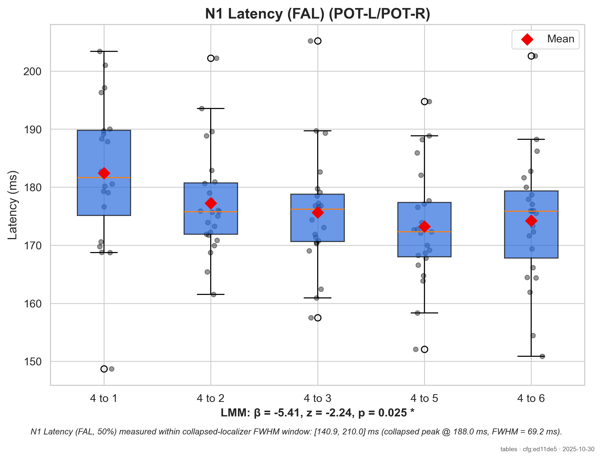

**Violin Plot:**

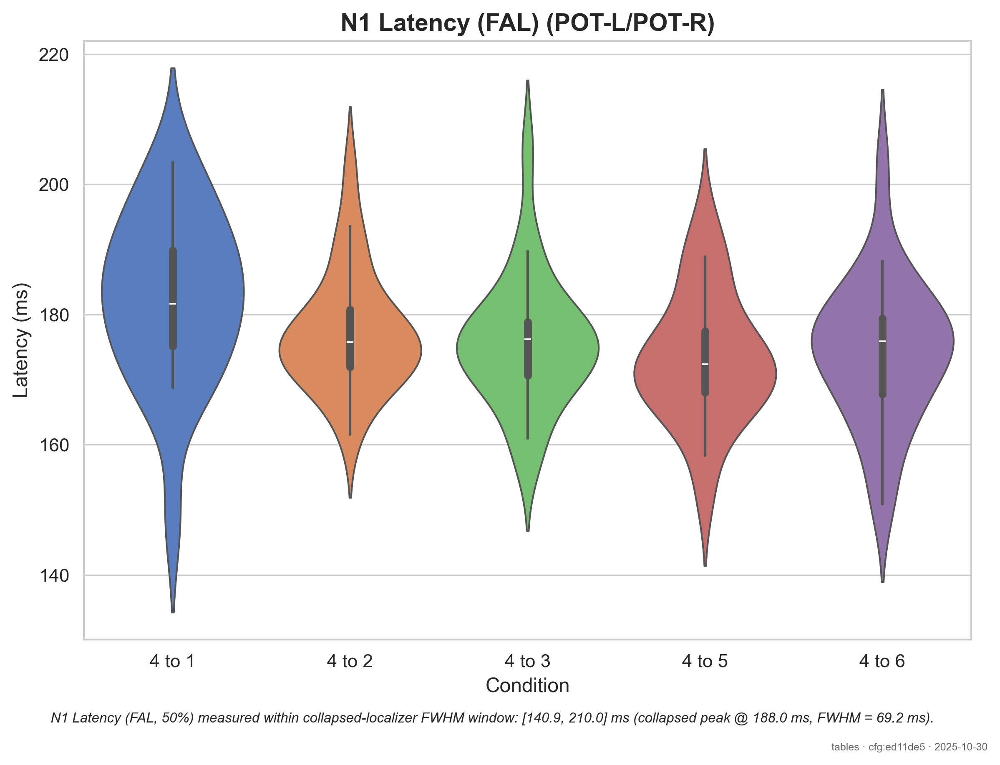

#### Amplitude

**Boxplot:**

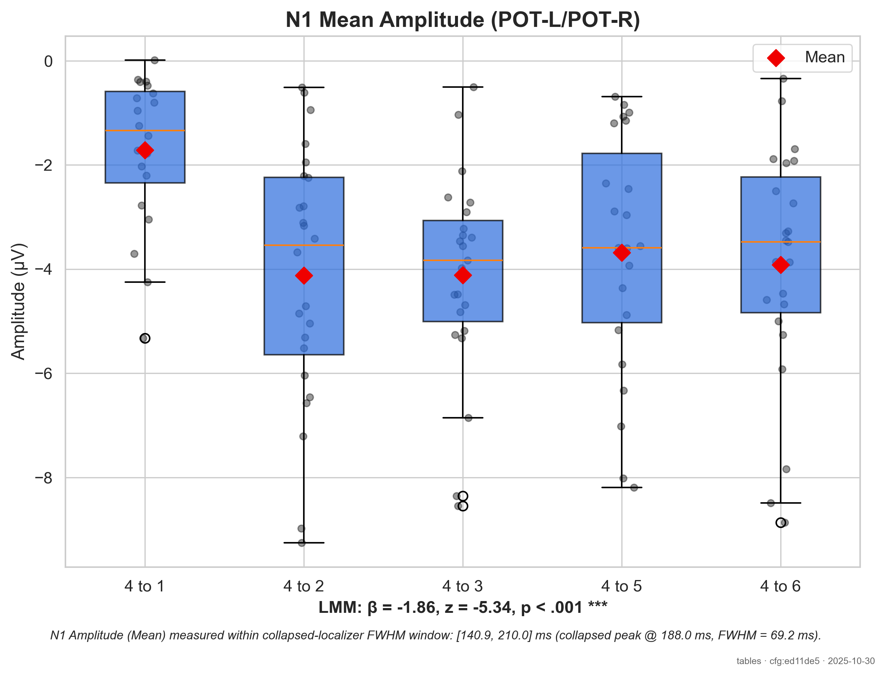

**Violin Plot:**

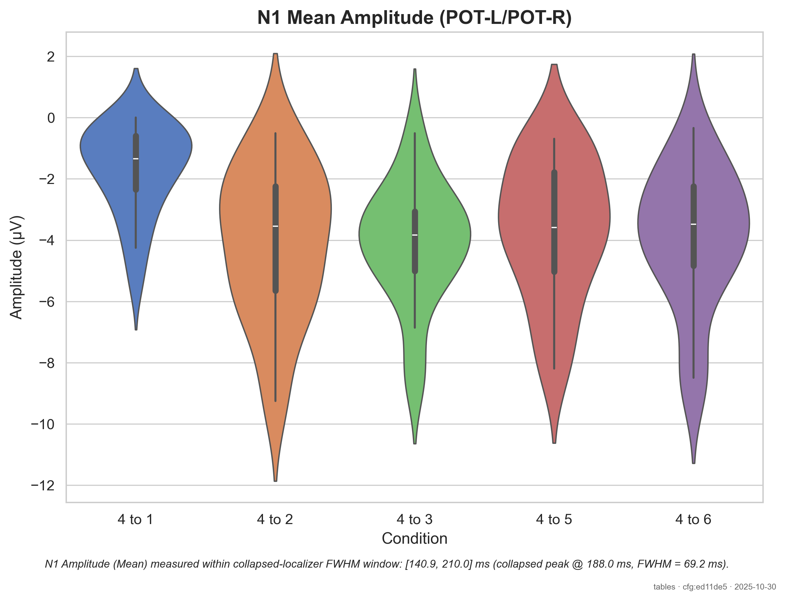

### 5.3 P1 Component

#### Latency

**Boxplot:**

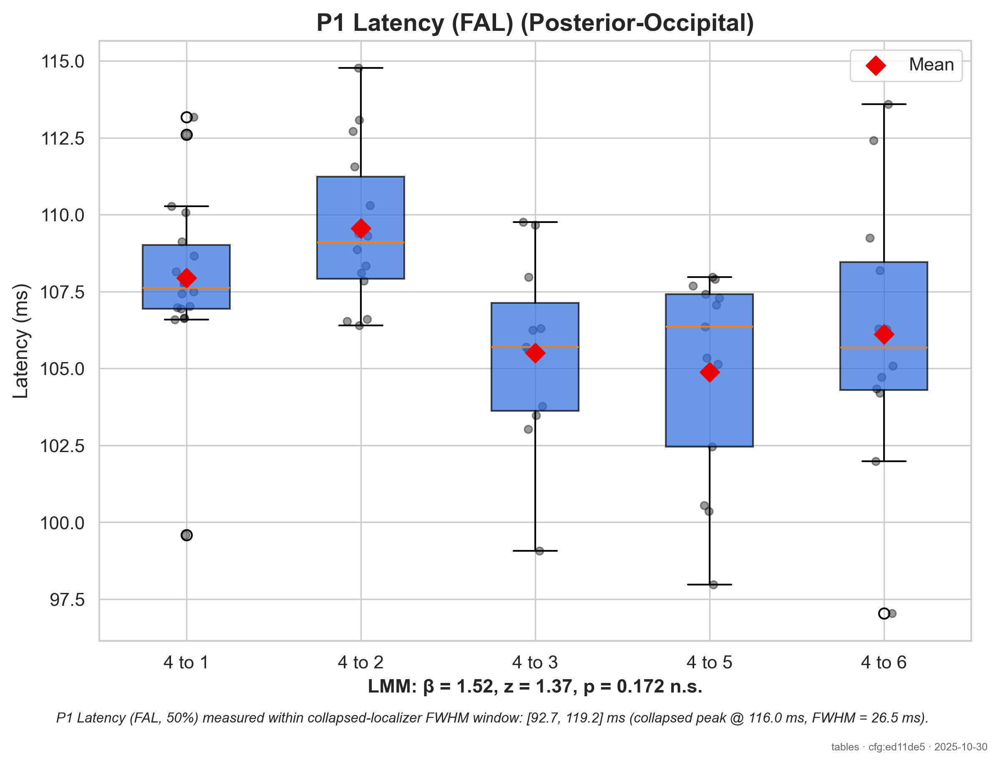

**Violin Plot:**

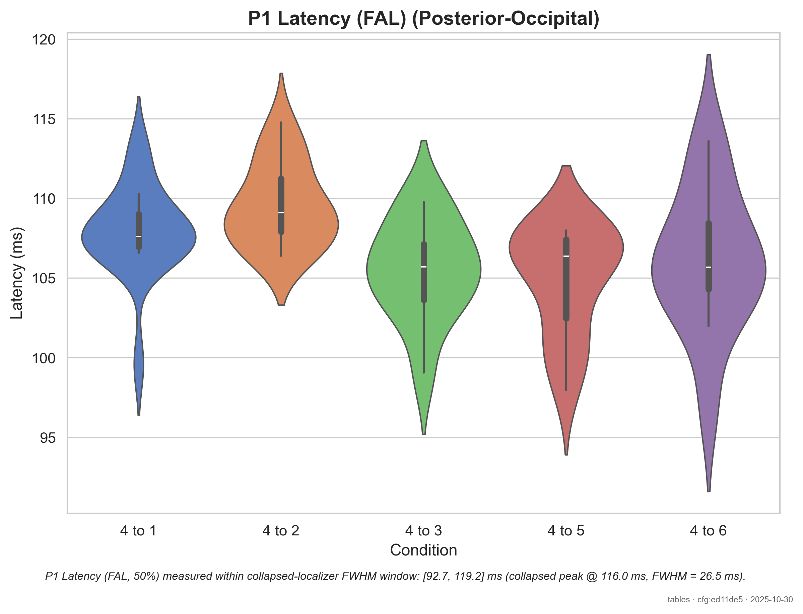

#### Amplitude

**Boxplot:**

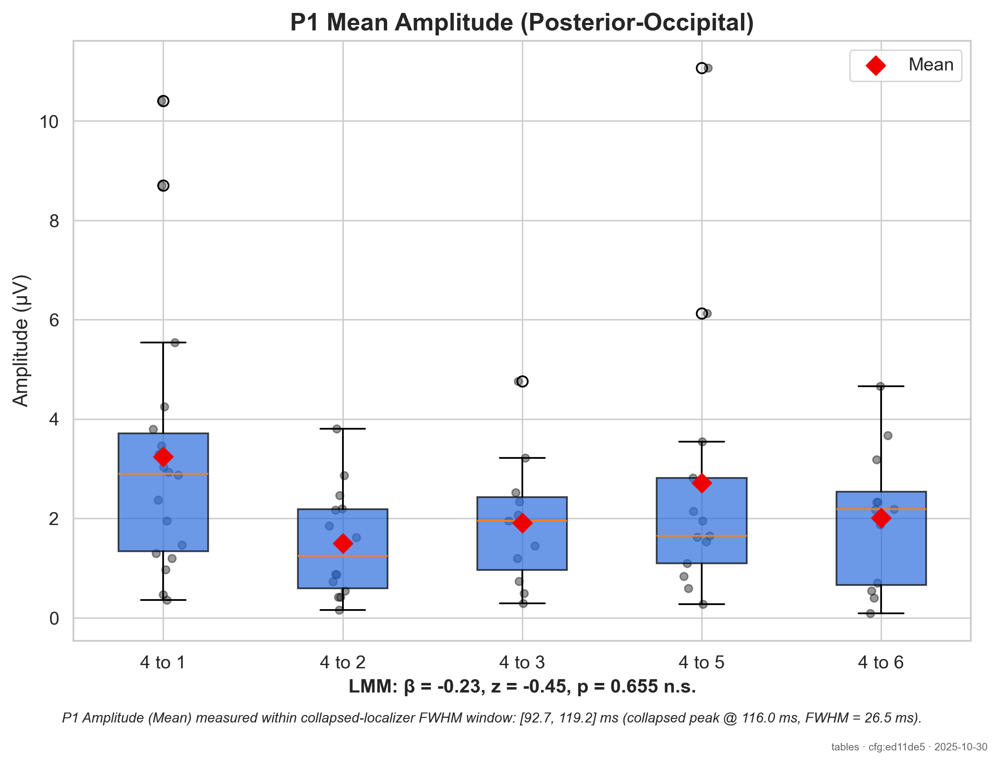

**Violin Plot:**

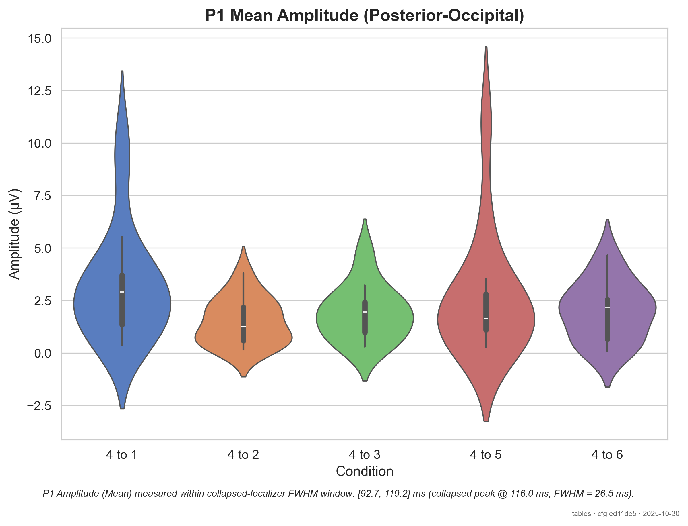

### 5.4 P3b Component

#### Latency

**Boxplot:**

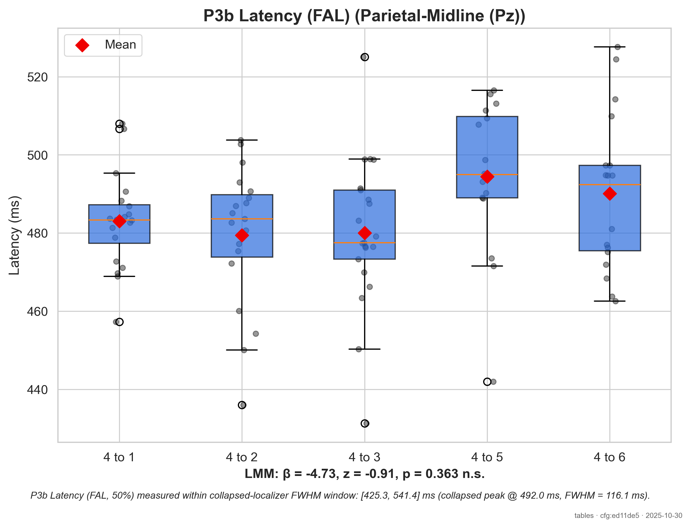

**Violin Plot:**

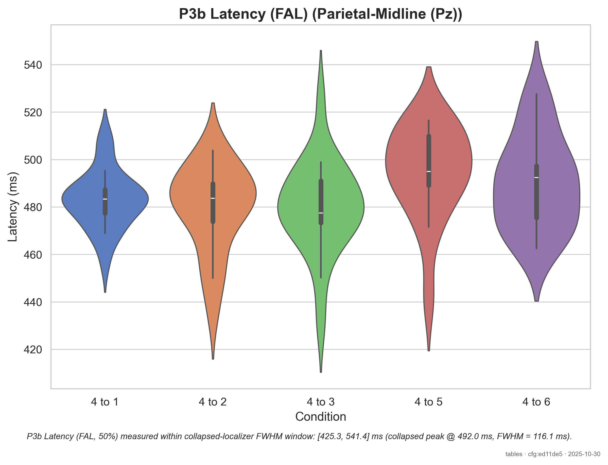

#### Amplitude

**Boxplot:**

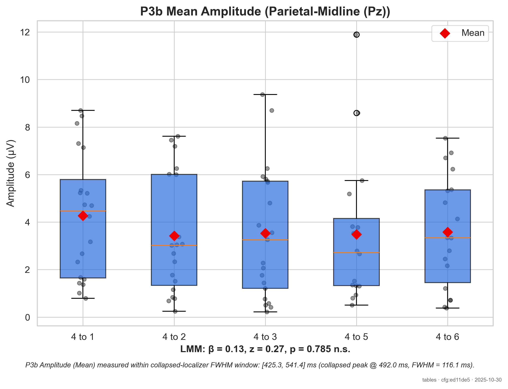

**Violin Plot:**

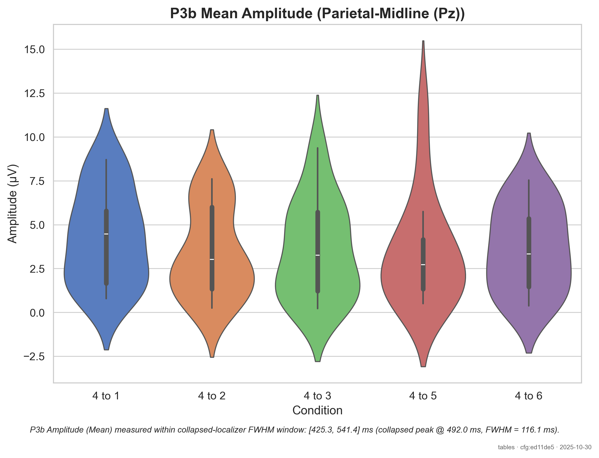

---

## 6. Methods Summary (for Publication)

### ERP Measurement

ERP components were measured using a collapsed localizer approach, where component peaks were identified from the grand average of all conditions combined to avoid circular analysis (Luck & Gaspelin, 2017). Measurement windows were defined as the full-width at half-maximum (FWHM) around each peak. Component latency was quantified using the 50% fractional area latency (FAL), which represents the time point at which the cumulative area under the curve reaches 50% of its total value within the measurement window. This metric provides a robust estimate of component timing with lower measurement error than peak latency (Kiesel et al., 2008). Mean amplitude was computed as the average voltage within the FWHM window across predefined regions of interest (ROI).

### Statistical Analysis

Linear mixed-effects models (LMM) with random intercepts for subjects were used as the primary analysis, as they optimally handle missing data via maximum likelihood estimation (Baayen et al., 2008). 
For comparison with traditional approaches, repeated-measures ANOVA and pairwise t-tests were also performed on complete cases; however, power was substantially reduced by listwise deletion. Therefore, LMM results are emphasized in interpretation.

Effect sizes are reported as Cohen's *d* for pairwise comparisons and generalized eta-squared (η²_G) for ANOVA.

### Software

- Python 3.12.11
- MNE-Python 1.10.1
- Statsmodels 0.14.5
- Pingouin 0.5.5

### References

- Baayen, R. H., Davidson, D. J., & Bates, D. M. (2008). Mixed-effects modeling with crossed random effects for subjects and items. *Journal of Memory and Language, 59*(4), 390-412.
- Kiesel, A., Miller, J., Jolicœur, P., & Brisson, B. (2008). Measurement of ERP latency differences: A comparison of single-participant and jackknife-based scoring methods. *Psychophysiology, 45*(2), 250-274.
- Luck, S. J., & Gaspelin, N. (2017). How to get statistically significant effects in any ERP experiment (and why you shouldn't). *Psychophysiology, 54*(1), 146-157.

---

---

*Report generated automatically by EEG Image Analysis Pipeline v2*
*For questions about this analysis, please refer to the YAML configuration and statistical output files.*
